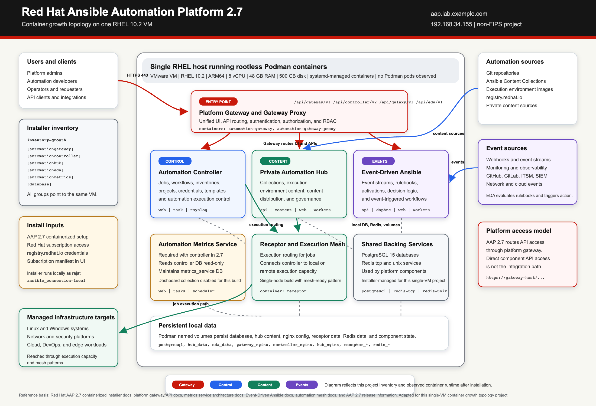

# Red Hat Ansible Automation Platform 2.7 Container Growth Topology Installation Project

## Table of Contents

- [Executive Summary](#executive-summary)
- [Introduction](#introduction)
- [Project Scope And Deliverables](#project-scope-and-deliverables)
- [Supporting Project Artifacts](#supporting-project-artifacts)
- [When To Use This Topology](#when-to-use-this-topology)
- [Architecture Decision And Design Rationale](#architecture-decision-and-design-rationale)
- [Target Architecture](#target-architecture)
- [AAP Component Overview](#aap-component-overview)
- [Assumptions, Constraints, And Non-Goals](#assumptions-constraints-and-non-goals)
- [Risk And Tradeoff Matrix](#risk-and-tradeoff-matrix)
- [System Requirements](#system-requirements)
- [Project Environment Used](#project-environment-used)
- [Understanding hub_seed_collections](#understanding-hub_seed_collections)
- [Installation Steps](#installation-steps)
- [Validation Matrix](#validation-matrix)
- [Post Installation Validation](#post-installation-validation)
- [Production Readiness Considerations](#production-readiness-considerations)
- [Post-Install Roadmap](#post-install-roadmap)
- [Enterprise Integration Opportunities](#enterprise-integration-opportunities)
- [Troubleshooting Notes](#troubleshooting-notes)
- [Summary](#summary)
- [Client-Facing Conclusion](#client-facing-conclusion)
- [References](#references)

## Executive Summary

This standalone project documents and validates a reproducible Red Hat Ansible Automation Platform 2.7 container growth topology installation. The design places platform gateway, automation controller, private automation hub, Event-Driven Ansible controller, Automation Metrics Service, PostgreSQL, and Redis on one RHEL 10.2 virtual machine.

From a solution architecture perspective, this topology is useful when the goal is speed, clarity, and functional validation rather than high availability. It gives architects, consultants, and platform teams a practical way to demonstrate the AAP operating model, validate integration patterns, and prepare a customer conversation around automation governance.

The design intentionally accepts a single-VM failure domain. That tradeoff is reasonable for projects, proofs of concept, demos, workshops, and small non-critical environments, but it should not be treated as a final enterprise production design without additional work.

The outcome of this project is a working AAP 2.7 installation plus a supporting architecture package for business requirements, technical requirements, traceability, decision records, network and security design, backup and restore, operations, acceptance evidence, production readiness, and optional post-install platform configuration.

## Introduction

This guide explains how to install Red Hat Ansible Automation Platform 2.7 using the container growth topology on a single Red Hat Enterprise Linux virtual machine.

In Red Hat documentation, this deployment model is called the container growth topology. Because all AAP components run on one VM in this project environment, it can also be described as an all-in-one single-VM deployment.

The goal is to build a practical project environment that includes the core AAP services on one host:

- platform gateway
- automation controller
- private automation hub
- Event-Driven Ansible controller
- Automation Metrics Service
- local PostgreSQL database
- Redis

This is not a high availability deployment. It is a project-oriented container growth topology that is useful for learning, demos, configuration-as-code testing, and reusable project environments.

## Project Scope And Deliverables

This directory is intentionally scoped as a standalone installation and architecture project. It shows how the platform can be planned, installed, validated, explained, and handed off with architecture context.

This project demonstrates:

- requirements and project sizing
- topology selection and design tradeoffs
- installation inventory design
- RHEL host preparation
- AAP 2.7 containerized installation
- component-level explanation
- validation evidence
- operational readiness considerations
- optional extension plan for post-install platform configuration

This project does not claim to be a production high availability architecture. It also does not claim that RBAC, SSO, workflows, execution environments, content synchronization, or enterprise integrations are fully implemented in this installation. Those items are defined as optional extensions in [post-install-platform-configuration.md](post-install-platform-configuration.md).

## Supporting Project Artifacts

| Artifact | Purpose |
| --- | --- |
| [business-requirements-document.md](business-requirements-document.md) | Defines the business problem, objectives, stakeholders, scope, business requirements, risks, and acceptance criteria. |
| [technical-requirements-document.md](technical-requirements-document.md) | Translates the business requirements into platform, infrastructure, security, operations, validation, integration, and nonfunctional requirements. |
| [requirements-traceability-matrix.md](requirements-traceability-matrix.md) | Maps business requirements to technical requirements, design artifacts, implementation evidence, validation evidence, and production gaps. |
| [stakeholder-operating-model.md](stakeholder-operating-model.md) | Defines stakeholders, ownership boundaries, responsibility model, and handoff expectations. |
| [architecture-decision-records.md](architecture-decision-records.md) | Captures the major architecture decisions, rationale, and consequences. |
| [architecture-views.md](architecture-views.md) | Provides context, deployment, access-flow, installation-flow, and data-persistence views. |
| [network-and-security-design.md](network-and-security-design.md) | Defines the project environment network model, trust boundaries, traffic matrix, and security posture. |
| [security-and-compliance-model.md](security-and-compliance-model.md) | Defines identity, access, secrets, certificates, FIPS, compliance posture, risks, and required evidence. |
| [backup-restore-and-dr.md](backup-restore-and-dr.md) | Defines backup, restore, and disaster recovery expectations for the single-VM topology. |
| [operations-runbook.md](operations-runbook.md) | Provides day-2 health checks, incident triage, change checks, and operational evidence guidance. |
| [acceptance-test-evidence.md](acceptance-test-evidence.md) | Summarizes the acceptance criteria and public evidence for the completed install. |
| [capacity-and-scaling-strategy.md](capacity-and-scaling-strategy.md) | Documents current sizing rationale, capacity watchpoints, scaling triggers, and growth path. |
| [production-readiness-roadmap.md](production-readiness-roadmap.md) | Defines the roadmap from the current project environment to a production-ready automation platform. |
| [known-limitations.md](known-limitations.md) | States the known limitations and when this project should not be used without additional work. |
| [architecture-review-checklist.md](architecture-review-checklist.md) | Provides a solution architecture review checklist and customer discussion prompts. |
| [post-install-platform-configuration.md](post-install-platform-configuration.md) | Defines optional extensions for turning the installed platform into a governed automation service. |
| [automation-implementation-roadmap.md](automation-implementation-roadmap.md) | Defines the recommended playbooks, roles, collection structure, and CI checks for the next automation phase. |
| [inventory-growth](inventory-growth) | Provides the sanitized installer inventory used by this project environment. |
| [images/aap-27-containerized-architecture.svg](images/aap-27-containerized-architecture.svg) | Provides the editable source for the architecture diagram. |

## When To Use This Topology

This topology is a good fit when you need a smaller-footprint AAP deployment and do not need platform redundancy.

Common use cases include:

| Use case | Why this topology fits |
| --- | --- |
| Learning and hands-on project environments | All major AAP components are available on one VM, which keeps the environment easier to understand and reset. |
| Proof of concept deployments | Teams can validate AAP workflows, content management, EDA, metrics, and integrations before designing an enterprise production topology. |
| Demo and enablement environments | A single-VM deployment is practical for demos, instructor-led training, workshops, and internal platform enablement. |
| Configuration-as-code development | Engineers can test organizations, teams, RBAC, inventories, projects, job templates, execution environments, workflows, and notifications in a realistic platform. |
| Reusable GitHub project | The topology provides enough platform depth to demonstrate enterprise automation architecture without requiring a multi-node environment. |
| Small non-critical environments | It can support smaller environments where redundancy is not required and the operational tradeoff is understood. |

This topology is not the right target when you need high availability, strict separation of platform services, independent database management, or large-scale production capacity. For those requirements, review Red Hat's enterprise topology and external database guidance.

## Architecture Decision And Design Rationale

The main architecture decision was to use the AAP 2.7 container growth topology on a single RHEL VM.

| Decision area | Selected approach | Rationale |
| --- | --- | --- |
| Deployment model | Containerized AAP on RHEL | Matches the AAP 2.7 containerized installation path and runs platform services as Podman-based containers on RHEL. |
| Topology | Container growth topology | Provides a smaller footprint deployment without redundancy, which is appropriate for this project environment and PoC scenario. |
| Host model | Single RHEL VM | Keeps the environment simple enough for readers to reproduce while still exposing the major AAP components. |
| Database | Installer-managed local PostgreSQL | Reduces setup complexity for the baseline install. Production designs should evaluate external PostgreSQL. |
| Redis | Standalone Redis | Fits the single-node project environment model. Clustered or enterprise patterns should be considered for production requirements. |
| FIPS | Non-FIPS | Keeps the project environment setup straightforward. If FIPS is required, it should be enabled at the RHEL operating system installation stage. |
| Content seeding | `hub_seed_collections=false` | Keeps the initial platform installation smaller and faster; content can be synchronized later after the platform is healthy. |
| Metrics | Metrics service installed on the same VM | Matches the growth topology pattern where metrics service runs with the other AAP components. |

### Why Not Container Enterprise Topology?

The container enterprise topology is a better fit when the target environment needs redundancy, higher compute capacity, and separation of platform functions. This project environment does not require those characteristics. The goal here is to create a reproducible baseline for learning, validation, and technical demonstration.

### Why Not Operator-Based Topology?

The Operator-based topologies are intended for Red Hat OpenShift Container Platform environments. This project environment is focused on a RHEL VM deployment, so the containerized installer is the more direct fit.

### Why Not External PostgreSQL From Day One?

An external database gives teams more control over database lifecycle, backups, performance, and reuse. For this first build, local PostgreSQL keeps the installation focused on platform bootstrap. A production design should revisit database placement, backup ownership, restore testing, and performance requirements.

## Target Architecture



The editable source for this diagram is available at [images/aap-27-containerized-architecture.svg](images/aap-27-containerized-architecture.svg).

The deployment uses the AAP 2.7 containerized installer and the `inventory-growth` inventory file. The installer is executed locally on the same VM where AAP is installed, so the inventory uses:

```ini
ansible_connection=local
```

## AAP Component Overview

Before installing the platform, it is useful to understand what each component does in this single-VM container growth topology.

### Platform Gateway

Platform gateway is the front door for Ansible Automation Platform. In AAP 2.7, users and API clients should enter the platform through the gateway instead of connecting directly to each individual component.

In this project environment, the gateway provides:

- the main web entry point at `https://aap.lab.example.com`
- centralized authentication and authorization
- platform-level RBAC
- routing to controller, hub, Event-Driven Ansible, and metrics APIs
- the unified platform user experience

The related containers are:

```text
automation-gateway
automation-gateway-proxy
```

### Automation Controller

Automation controller is the execution control plane. This is where you define the objects required to run automation at scale.

Controller manages:

- inventories and inventory sources
- credentials
- projects linked to source control
- job templates
- workflow job templates
- schedules, surveys, notifications, and job history
- execution capacity through receptor and execution nodes

In this project environment, controller runs as separate web, task, and rsyslog containers:

```text
automation-controller-web
automation-controller-task
automation-controller-rsyslog
```

### Private Automation Hub

Private automation hub is the internal content repository for automation teams. It gives you a place to store, synchronize, publish, and govern automation content.

Private automation hub is commonly used for:

- certified Ansible Content Collections
- validated or internally developed collections
- execution environment images
- content synchronization from Red Hat automation hub, Ansible Galaxy, or other registries
- content promotion across development, test, and production environments

In this project environment, `hub_seed_collections=false` was used, so hub was installed without seeding initial collections during the base installation. Collections can be synchronized or uploaded later.

The related containers are:

```text
automation-hub-api
automation-hub-content
automation-hub-web
automation-hub-worker-1
automation-hub-worker-2
```

### Event-Driven Ansible Controller

Event-Driven Ansible controller handles automation decisions based on events. Instead of waiting for an operator to start a job manually, EDA can listen for events, evaluate rulebooks, and trigger automation when defined conditions are met.

EDA is useful for:

- webhook-driven automation
- monitoring and observability events
- ITSM and ticketing events
- security and compliance signals
- network and cloud event streams
- self-healing operations

EDA can trigger automation controller jobs or workflows when a rulebook condition matches.

The related containers are:

```text
automation-eda-api
automation-eda-daphne
automation-eda-web
automation-eda-worker-1
automation-eda-worker-2
automation-eda-activation-worker-1
automation-eda-activation-worker-2
```

### Automation Metrics Service

Automation Metrics Service is part of AAP 2.7 and is enabled during the containerized installation. It collects anonymized usage and performance data from automation controller.

In this project environment, metrics service:

- has its own PostgreSQL database
- has read-only access to the automation controller database
- runs as containerized workloads managed by the installer
- was installed with dashboard collection disabled by setting `FEATURE_DASHBOARD_COLLECTION_ENABLED=false`

The related containers are:

```text
automation-metrics-web
automation-metrics-tasks
automation-metrics-scheduler
```

### Local PostgreSQL Database

PostgreSQL is the relational database layer for the platform. In this single-VM project environment, the installer deployed PostgreSQL locally on the same VM.

The local PostgreSQL service stores data for platform components such as:

- platform gateway
- automation controller
- private automation hub
- Event-Driven Ansible controller
- Automation Metrics Service

The related container is:

```text
postgresql
```

The related volume is:

```text
postgresql
```

For production, evaluate Red Hat's guidance for supported external database designs, backup, restore, performance, and high availability.

### Redis

Redis provides in-memory caching and queueing services used by AAP components. In this project environment, Redis was configured in standalone mode because the deployment is a single-node project environment.

Redis supports platform behavior such as:

- cache data
- session-related data
- event queueing
- component communication patterns that benefit from fast in-memory storage

The related containers and volumes are:

```text
redis-unix
redis-tcp
redis_data_unix
redis_data_tcp
redis_run
```

## Assumptions, Constraints, And Non-Goals

| Category | Item | Detail |
| --- | --- | --- |
| Assumption | Red Hat subscriptions are available | The VM has access to RHEL content and the AAP installer/images. |
| Assumption | DNS and host resolution are controlled | The project environment uses `aap.lab.example.com` with static IP `192.168.34.155`. |
| Assumption | Installer user has sudo access | The `rajat` user is part of the `wheel` group. |
| Constraint | Single VM | All platform services share the same compute, storage, network, and failure domain. |
| Constraint | Local PostgreSQL | Database lifecycle is tied to the AAP VM in this project environment. |
| Constraint | Standalone Redis | Redis is not deployed as a highly available clustered service. |
| Constraint | Non-FIPS | This project environment is not designed for FIPS-regulated environments. |
| Constraint | Certificate posture | Browser certificate warnings can occur when installer-generated certificates are used. |
| Non-goal | High availability | This project does not build a redundant platform. |
| Non-goal | Production hardening | This project does not fully cover SSO, backup automation, monitoring, DR, certificate lifecycle, or network segmentation. |
| Non-goal | Multi-site architecture | This project does not design distributed automation mesh or multi-region resiliency. |

## Risk And Tradeoff Matrix

| Decision | Benefit | Tradeoff | Mitigation |
| --- | --- | --- | --- |
| Single-VM deployment | Fast to deploy and easy to understand | VM failure affects the entire platform | Use for learning, PoC, demo, and small non-critical use cases only. |
| Local PostgreSQL | Simplifies the first installation | Database availability and backup lifecycle depend on the same VM | Move to external PostgreSQL for production-aligned designs. |
| Standalone Redis | Keeps Redis configuration simple | No Redis-level redundancy | Review enterprise topology and Redis requirements for production. |
| Non-FIPS installation | Reduces project complexity | Not suitable for regulated FIPS requirements | Enable FIPS during RHEL installation when required. |
| `hub_seed_collections=false` | Faster initial install with lower content footprint | Hub starts without seeded collections | Sync certified, validated, and internal content after platform validation. |
| Installer-generated certificates | Speeds up initial validation | Browser trust warnings and not production-grade trust model | Use organization-approved certificates for production. |
| All components on one host | Shows the complete AAP service model quickly | Shared resource contention across services | Size the VM appropriately and use enterprise topology when workload grows. |

## System Requirements

Before starting, make sure you have:

- Red Hat account with access to Ansible Automation Platform 2.7 downloads.
- Active Red Hat subscription for the RHEL VM.
- Red Hat registry credentials or service account credentials for `registry.redhat.io`.
- Red Hat Enterprise Linux host supported by the AAP 2.7 containerized installer.
- Non-root installation user with sudo access.
- Static IP address.
- Fully qualified domain name.
- Working DNS resolution from the VM and from the workstation.
- Time synchronization enabled.
- Internet access from the VM to Red Hat services.

The official AAP 2.7 containerized installer system requirements include:

| Requirement | Minimum / Supported Value |
| --- | --- |
| Operating system | RHEL 9.6 or later minor versions of RHEL 9, or RHEL 10 or later minor versions of RHEL 10 |
| CPU architecture | `x86_64`, `AArch64`, `s390x`, or `ppc64le` |
| CPU | 4 vCPU minimum |
| Memory | 16 GB minimum |
| Disk | 60 GB total available disk space minimum |
| Disk IOPS | 3000 minimum |
| Installation directory | 15 GB if using a dedicated partition |
| `/var/tmp` for online install | 1 GB |
| `/var/tmp` for offline or bundled install | 3 GB |
| Temporary directory for offline or bundled install | 10 GB |

> [!NOTE]
> For growth topology bundled installations with `hub_seed_collections=true`, Red Hat documents 32 GB memory as required. In this project environment, `hub_seed_collections=false` was used.

## Project Environment Used

The installation in this guide was completed with the following project configuration:

| Setting | Value |
| --- | --- |
| AAP version | 2.7 |
| Installer package | `ansible-automation-platform-containerized-setup-2.7-2` |
| Topology | Container growth topology |
| Deployment style | All-in-one / single RHEL VM project environment |
| Hostname/FQDN | `aap.lab.example.com` |
| Static IP | `192.168.34.155` |
| Operating system | Red Hat Enterprise Linux 10.2 |
| Architecture | ARM64 / AArch64 |
| Virtualization | VMware |
| Network interface | `enp2s0` |
| FIPS mode | Disabled |
| Installer user | `rajat` |
| Installer user sudo access | Enabled through `wheel` |
| vCPU | 8 |
| RAM | 48 GB |
| Disk | 500 GB |
| Podman version | 5.8.2 |
| Time zone | `America/Toronto` |

### FIPS Decision

This project environment was installed in non-FIPS mode.

If you need FIPS mode, enable FIPS during the RHEL installation. Do not install AAP first and attempt to retrofit FIPS later.

## Understanding hub_seed_collections

The `hub_seed_collections` variable controls whether the installer seeds private automation hub with initial automation content during installation.

Use:

```ini
hub_seed_collections=true
```

when you want the installer to seed automation hub content during the initial deployment. This can be useful when you want a more complete hub experience immediately after installation, but it increases installation time and resource usage. Red Hat documents a higher memory requirement for growth topology bundled installations when this value is enabled.

Use:

```ini
hub_seed_collections=false
```

when you want a smaller and faster base platform installation. With this option, private automation hub is installed, but you can add or sync collections later after the platform is stable.

This project environment used:

```ini
hub_seed_collections=false
```

The reason was practical: first complete the container growth topology installation, verify gateway, controller, hub, EDA, metrics, PostgreSQL, and Redis, then manage automation content as an optional post-install extension.

## Installation Steps

### Step 1 - Create The RHEL VM

Create a RHEL VM with at least the official minimum resources. For this project environment, the VM was created with:

- 8 vCPU
- 48 GB RAM
- 500 GB disk
- RHEL 10.2
- static IPv4 address
- non-FIPS mode
- non-root installation user with sudo access

Set the hostname:

```console
[rajat@aap ~]$ sudo hostnamectl set-hostname aap.lab.example.com
```

Result:

```text
# no output
```

Reboot if needed:

```console
[rajat@aap ~]$ sudo reboot
```

Result:

```text
# the SSH session disconnects while the VM reboots
```

### Step 2 - Validate The Sudo User

This project environment used a non-root user named `rajat`.

Verify the user:

```console
[rajat@aap ~]$ id rajat
```

Example output:

```text
uid=1000(rajat) gid=1000(rajat) groups=1000(rajat),10(wheel),190(systemd-journal)
```

Verify group membership:

```console
[rajat@aap ~]$ groups rajat
```

Example output:

```text
rajat : rajat wheel systemd-journal
```

> [!NOTE]
> The installation user must be part of the `wheel` group, or must otherwise have sudo access.

> [!NOTE]
> If the user is not part of the `wheel` group, run the following command and then log out and log back in.

Add the user to `wheel` only if required:

```console
[rajat@aap ~]$ sudo usermod -aG wheel rajat
```

Result:

```text
# no output
```

### Step 3 - Register The RHEL System

Register the VM to Red Hat Subscription Management:

```console
[rajat@aap ~]$ sudo rhc connect
```

Example successful result:

```text
Connecting aap.lab.example.com to Red Hat.
This might take a few seconds.

[OK] Connected to Red Hat Subscription Management
[OK] Connected to Red Hat Lightspeed
[OK] Activated the Remote Host Configuration daemon

Successfully connected to Red Hat!

Manage your connected systems: https://red.ht/connector
```

If your organization uses activation keys, use the activation key and organization ID form:

```console
[rajat@aap ~]$ sudo rhc connect --activation-key=<activation_key_name> --organization=<organization_id>
```

Example successful result:

```text
Connecting aap.lab.example.com to Red Hat.
This might take a few seconds.

[OK] Connected to Red Hat Subscription Management
[OK] Connected to Red Hat Lightspeed
[OK] Activated the Remote Host Configuration daemon

Successfully connected to Red Hat!

Manage your connected systems: https://red.ht/connector
```

Validate the connection:

```console
[rajat@aap ~]$ sudo rhc status
```

Example output:

```text
Connection status for aap.lab.example.com:

 [OK] Connected to Red Hat Subscription Management
  [OK] Content ... Red Hat repository file generated
  [OK] Analytics ... Connected to Red Hat Lightspeed (formerly Insights)
  [OK] Remote Management ... The yggdrasil service is active

Manage your connected systems: https://red.ht/connector
```

Confirm that the system is connected to:

- Red Hat Subscription Management
- Red Hat content repositories
- Red Hat Lightspeed or Insights

Update the system:

```console
[rajat@aap ~]$ sudo dnf update -y
```

Example output when the system is already current:

```text
Updating Subscription Management repositories.
Dependencies resolved.
Nothing to do.
Complete!
```

Verify Podman:

```console
[rajat@aap ~]$ podman --version
```

Example output:

```text
podman version 5.8.2
```

### Step 4 - Validate Hostname, IP, And Time

Validate the hostname:

```console
[rajat@aap ~]$ hostnamectl
```

Example output:

```text
 Static hostname: aap.lab.example.com
       Icon name: computer-vm
         Chassis: vm
      Machine ID: c7a92dd1a4b4492b96f160a008694a6b
         Boot ID: ce1ddcbc6e734631a2bf37d954fad598
    AF_VSOCK CID: 2260614082
  Virtualization: vmware
Operating System: Red Hat Enterprise Linux 10.2 (Coughlan)
     CPE OS Name: cpe:/o:redhat:enterprise_linux:10.2
          Kernel: Linux 6.12.0-211.34.1.el10_2.aarch64
    Architecture: arm64
 Hardware Vendor: VMware, Inc.
  Hardware Model: VMware20,1
Firmware Version: VMW201.00V.25275966.BA64.2603102050
   Firmware Date: Tue 2026-03-10
    Firmware Age: 4month 1w 2d
```

Validate the IP address:

```console
[rajat@aap ~]$ ip addr
```

Example output:

```text
1: lo: <LOOPBACK,UP,LOWER_UP> mtu 65536 qdisc noqueue state UNKNOWN group default qlen 1000
    link/loopback 00:00:00:00:00:00 brd 00:00:00:00:00:00
    inet 127.0.0.1/8 scope host lo
       valid_lft forever preferred_lft forever
    inet6 ::1/128 scope host noprefixroute
       valid_lft forever preferred_lft forever
2: enp2s0: <BROADCAST,MULTICAST,UP,LOWER_UP> mtu 1500 qdisc fq_codel state UP group default qlen 1000
    link/ether 00:0c:29:be:3b:c2 brd ff:ff:ff:ff:ff:ff
    altname enx000c29be3bc2
    inet 192.168.34.155/24 brd 192.168.34.255 scope global noprefixroute enp2s0
       valid_lft forever preferred_lft forever
    inet6 fe80::20c:29ff:febe:3bc2/64 scope link noprefixroute
       valid_lft forever preferred_lft forever
```

Validate time synchronization:

```console
[rajat@aap ~]$ timedatectl
```

Example output:

```text
               Local time: Sat 2026-07-18 19:17:37 EDT
           Universal time: Sat 2026-07-18 23:17:37 UTC
                 RTC time: Sat 2026-07-18 23:17:38
                Time zone: America/Toronto (EDT, -0400)
System clock synchronized: yes
              NTP service: active
          RTC in local TZ: no
```

### Step 5 - Configure Name Resolution

The VM must resolve its own FQDN to the static IPv4 address.

Edit `/etc/hosts`:

```console
[rajat@aap ~]$ sudo vi /etc/hosts
```

Result:

```text
# no output after saving and exiting the editor
```

Add:

```text
192.168.34.155 aap.lab.example.com aap
```

Verify the file:

```console
[rajat@aap ~]$ cat /etc/hosts
```

Example output:

```text
# Loopback entries; do not change.
# For historical reasons, localhost precedes localhost.localdomain:
127.0.0.1   localhost localhost.localdomain localhost4 localhost4.localdomain4
::1         localhost localhost.localdomain localhost6 localhost6.localdomain6
# See hosts(5) for proper format and other examples:
# 192.168.1.10 foo.example.org foo
# 192.168.1.13 bar.example.org bar
192.168.34.155 aap.lab.example.com aap
```

Validate basic name resolution:

```console
[rajat@aap ~]$ getent hosts aap.lab.example.com
```

Example output:

```text
fe80::20c:29ff:febe:3bc2 aap.lab.example.com
```

In this project environment, `getent hosts` returned an IPv6 link-local address through `myhostname`, so the IPv4 lookup was also validated.

Validate IPv4 name resolution:

```console
[rajat@aap ~]$ getent ahostsv4 aap.lab.example.com
```

Example output:

```text
192.168.34.155  STREAM aap.lab.example.com
192.168.34.155  DGRAM
192.168.34.155  RAW
```

Confirm host lookup order:

```console
[rajat@aap ~]$ grep '^hosts:' /etc/nsswitch.conf
```

Example output:

```text
hosts:      files  dns myhostname
```

Confirm that `files` appears before `dns` so `/etc/hosts` is checked before DNS.

### Step 6 - Validate Workstation Access

From your workstation, confirm that the VM is reachable by IP address:

```console
$ ping -c 2 192.168.34.155
```

Example output:

```text
PING 192.168.34.155 (192.168.34.155): 56 data bytes
64 bytes from 192.168.34.155: icmp_seq=0 ttl=64 time=0.431 ms
64 bytes from 192.168.34.155: icmp_seq=1 ttl=64 time=1.158 ms

--- 192.168.34.155 ping statistics ---
2 packets transmitted, 2 packets received, 0.0% packet loss
round-trip min/avg/max/stddev = 0.431/0.794/1.158/0.363 ms
```

Confirm that the VM is reachable by FQDN:

```console
$ ping -c 2 aap.lab.example.com
```

Example output:

```text
PING aap.lab.example.com (192.168.34.155): 56 data bytes
64 bytes from 192.168.34.155: icmp_seq=0 ttl=64 time=0.525 ms
64 bytes from 192.168.34.155: icmp_seq=1 ttl=64 time=0.848 ms

--- aap.lab.example.com ping statistics ---
2 packets transmitted, 2 packets received, 0.0% packet loss
round-trip min/avg/max/stddev = 0.525/0.686/0.848/0.161 ms
```

Confirm SSH access:

```console
$ ssh rajat@aap.lab.example.com
```

Example output after successful login:

```text
[rajat@aap ~]$
```

If your workstation cannot resolve `aap.lab.example.com`, add the same entry to your local DNS or workstation hosts file.

### Step 7 - Validate Registry DNS And Login

The online containerized installer pulls images from `registry.redhat.io`.

Validate registry DNS from the VM:

```console
[rajat@aap ~]$ getent hosts registry.redhat.io
```

Example output:

```text
2600:1f18:d77:9000:b0b1:dd53:cab5:bbc3 registry-proxy-134442355.us-east-1.elb.amazonaws.com registry.redhat.io
2600:1f18:d77:9001:21a:aeb5:d63e:eb0f registry-proxy-134442355.us-east-1.elb.amazonaws.com registry.redhat.io
2600:1f18:d77:9001:ca6:8904:2a40:eabf registry-proxy-134442355.us-east-1.elb.amazonaws.com registry.redhat.io
2600:1f18:d77:9002:560d:db51:6200:3bd6 registry-proxy-134442355.us-east-1.elb.amazonaws.com registry.redhat.io
2600:1f18:d77:9002:a26e:8165:eae1:8ae5 registry-proxy-134442355.us-east-1.elb.amazonaws.com registry.redhat.io
2600:1f18:d77:9000:fe19:bebe:cb94:9f0c registry-proxy-134442355.us-east-1.elb.amazonaws.com registry.redhat.io
```

Validate registry HTTPS connectivity:

```console
[rajat@aap ~]$ curl -I -sS https://registry.redhat.io/v2/
```

Example output:

```text
HTTP/2 401
date: Sat, 18 Jul 2026 23:17:38 GMT
content-type: application/json
content-length: 99
docker-distribution-api-version: registry/2.0
www-authenticate: Bearer realm="https://registry.redhat.io/auth/realms/rhcc/protocol/redhat-docker-v2/auth",service="docker-registry"
```

An HTTP `401 Unauthorized` response from `curl` is acceptable before login. It confirms DNS, routing, and TLS connectivity.

Log in to the registry:

```console
[rajat@aap ~]$ podman login registry.redhat.io
```

Example successful result:

```text
Username: <registry_username>
Password:
Login Succeeded!
```

### Step 8 - Download And Extract The AAP Installer

Download the AAP 2.7 containerized setup package from the Red Hat Customer Portal.

In this project environment, the package was placed under `/home/rajat`:

```text
/home/rajat/ansible-automation-platform-containerized-setup-2.7-2.tar
/home/rajat/ansible-automation-platform-containerized-setup-2.7-2/
```

If you have the tar file, extract it:

```console
[rajat@aap ~]$ cd /home/rajat
```

Result:

```text
# no output
```

Extract the tar file:

```console
[rajat@aap ~]$ tar -xf ansible-automation-platform-containerized-setup-2.7-2.tar
```

Result:

```text
# no output
```

Change into the extracted installer directory:

```console
[rajat@aap ~]$ cd ansible-automation-platform-containerized-setup-2.7-2
```

Result:

```text
# no output
```

Inspect the installer directory:

```console
[rajat@aap ansible-automation-platform-containerized-setup-2.7-2]$ ls -la
```

Example output:

```text
total 92
drwxr-xr-x.  3 rajat rajat    158 Jul 14 23:48 .
drwx------. 18 rajat rajat   4096 Jul 14 23:49 ..
-rw-r--r--.  1 rajat rajat    146 Jun 18 11:52 ansible.cfg
drwxr-xr-x.  3 rajat rajat     33 Jun 18 11:52 collections
-rw-r--r--.  1 rajat rajat   3662 Jun 18 11:52 inventory
-rw-r--r--.  1 rajat rajat   3443 Jun 18 11:52 inventory-growth
-rw-r--r--.  1 rajat rajat  74768 Jun 18 11:52 README.md
```

Inspect the inventory files:

```console
[rajat@aap ansible-automation-platform-containerized-setup-2.7-2]$ ls -la inventory*
```

Example output:

```text
-rw-r--r--. 1 rajat rajat 3662 Jun 18 11:52 inventory
-rw-r--r--. 1 rajat rajat 3443 Jun 18 11:52 inventory-growth
```

### Step 9 - Back Up The Original Inventory

The installer includes inventory examples. This project environment used `inventory-growth`.

Back up the original file:

```console
[rajat@aap ansible-automation-platform-containerized-setup-2.7-2]$ cp -p inventory-growth inventory-growth.original
```

Result:

```text
# no output
```

Make the backup read-only:

```console
[rajat@aap ansible-automation-platform-containerized-setup-2.7-2]$ chmod 400 inventory-growth.original
```

Result:

```text
# no output
```

Make the working inventory writable by the owner:

```console
[rajat@aap ansible-automation-platform-containerized-setup-2.7-2]$ chmod 600 inventory-growth
```

Result:

```text
# no output
```

This gives you a clean reference copy if the install fails.

Verify the inventory files:

```console
[rajat@aap ansible-automation-platform-containerized-setup-2.7-2]$ ls -la inventory*
```

Example output:

```text
-rw-r--r--. 1 rajat rajat 3662 Jun 18 11:52 inventory
-rw-------. 1 rajat rajat 3443 Jul 14 23:48 inventory-growth
-r--------. 1 rajat rajat 3443 Jun 18 11:52 inventory-growth.original
```

### Step 10 - Configure `inventory-growth`

Edit `inventory-growth` directly:

```console
[rajat@aap ansible-automation-platform-containerized-setup-2.7-2]$ vi inventory-growth
```

Result:

```text
# no output after saving and exiting the editor
```

The sanitized inventory used for this project environment is shown below. The real VM-side inventory used private values, but all password values are redacted here with `<redacted>`.

> [!IMPORTANT]
> Do not paste `<redacted>` into a real installer inventory. Replace every `<redacted>` value with a private password before running the installer. Replace `<username>` with your Red Hat registry username or service account username.

```ini
# This is the AAP installer inventory file intended for the Container growth deployment topology.
# This inventory file expects to be run from the host where AAP will be installed.
# Please consult the Ansible Automation Platform product documentation about this topology's tested hardware configuration.
# https://docs.redhat.com/en/documentation/red_hat_ansible_automation_platform/2.7/plan-ref_installation_deployment_models
#
# Please consult the docs if you're unsure what to add.
# For all optional variables, consult the included README.md
# or the Ansible Automation Platform documentation:
# https://docs.redhat.com/en/documentation/red_hat_ansible_automation_platform/2.7/install-con_aap_containerized_installation_intro

# This section is for your AAP Gateway host(s)
# -----------------------------------------------------
[automationgateway]
aap.lab.example.com

# This section is for your AAP Controller host(s)
# -----------------------------------------------------
[automationcontroller]
aap.lab.example.com

# This section is for your AAP Automation Hub host(s)
# -----------------------------------------------------
[automationhub]
aap.lab.example.com

# This section is for your AAP EDA Controller host(s)
# -----------------------------------------------------
[automationeda]
aap.lab.example.com

# This section is for your AAP Automation Metrics Service host(s)
# -----------------------------------------------------
[automationmetrics]
aap.lab.example.com

# This section is for your AAP Lightspeed host(s)
# -----------------------------------------------------
# [ansiblelightspeed]
# aap.example.org

# This section is for your Ansible MCP Server host(s)
# -----------------------------------------------------
# [ansiblemcp]
# aap.example.org

# This section is for the AAP database
# -----------------------------------------------------
[database]
aap.lab.example.com

[all:vars]
# Ansible
ansible_connection=local

# For a comprehensive list of all inventory file variables, see:
# https://docs.redhat.com/en/documentation/red_hat_ansible_automation_platform/2.7/install-assembly_appendix_inventory_file_vars

# Common variables
# -----------------------------------------------------
postgresql_admin_username=postgres
postgresql_admin_password=<redacted>

registry_username=<username>
registry_password=<redacted>

redis_mode=standalone

# AAP Gateway
# -----------------------------------------------------
gateway_admin_password=<redacted>
gateway_pg_host=aap.lab.example.com
gateway_pg_password=<redacted>

# AAP Controller
# -----------------------------------------------------
controller_admin_password=<redacted>
controller_pg_host=aap.lab.example.com
controller_pg_password=<redacted>
controller_percent_memory_capacity=0.5

# AAP Automation Hub
# -----------------------------------------------------
hub_admin_password=<redacted>
hub_pg_host=aap.lab.example.com
hub_pg_password=<redacted>
hub_seed_collections=false

# AAP EDA Controller
# -----------------------------------------------------
eda_admin_password=<redacted>
eda_pg_host=aap.lab.example.com
eda_pg_password=<redacted>

# AAP Automation Metrics Service
# -----------------------------------------------------
automationmetrics_pg_host=aap.lab.example.com
automationmetrics_pg_password=<redacted>
automationmetrics_controller_read_pg_host=aap.lab.example.com
automationmetrics_controller_read_pg_password=<redacted>
FEATURE_DASHBOARD_COLLECTION_ENABLED=false
```

### Inventory Group Explanation

| Section | Value used | Explanation |
| --- | --- | --- |
| `[automationgateway]` | `aap.lab.example.com` | Installs the platform gateway on the single VM. The gateway is the main web and API entry point for AAP 2.7. |
| `[automationcontroller]` | `aap.lab.example.com` | Installs automation controller on the same VM. Controller manages inventories, credentials, projects, job templates, workflows, and job execution. |
| `[automationhub]` | `aap.lab.example.com` | Installs private automation hub on the same VM. Hub manages automation content such as collections and execution environment content. |
| `[automationeda]` | `aap.lab.example.com` | Installs Event-Driven Ansible controller on the same VM. EDA handles rulebooks, event sources, and event-driven automation. |
| `[automationmetrics]` | `aap.lab.example.com` | Installs Automation Metrics Service on the same VM. For this AAP 2.7 growth topology, the installer preflight required a metrics node. |
| `[database]` | `aap.lab.example.com` | Places PostgreSQL on the same VM. Each platform service uses PostgreSQL, but this project environment keeps the database local. |
| `# [ansiblelightspeed]` | commented | Lightspeed was intentionally deferred. It can be added later after the base platform is stable and the required model/provider configuration is ready. |
| `# [ansiblemcp]` | commented | Ansible MCP Server was intentionally deferred. It can be added later as an optional extension after the base platform install is validated. |
| `[all:vars]` | applies globally | Defines variables that apply to all hosts in the inventory. In this project environment, there is only one host. |

### Inventory Variable Explanation

| Variable | Value used | Explanation |
| --- | --- | --- |
| `ansible_connection` | `local` | Tells Ansible to run installer tasks locally on the same VM instead of using SSH to reach another host. This is correct because the installer runs from `aap.lab.example.com` and installs AAP on `aap.lab.example.com`. |
| `postgresql_admin_username` | `postgres` | PostgreSQL administrative user used by the installer when creating platform databases and database users. The installer default is `postgres`, and this project environment kept that value. |
| `postgresql_admin_password` | `<redacted>` | Password for the PostgreSQL admin user. It is required for database creation and must be a real private value in the VM inventory. |
| `registry_username` | `<username>` | Red Hat registry username or service account username used to pull AAP container images from `registry.redhat.io`. |
| `registry_password` | `<redacted>` | Red Hat registry password or service account token. This must never be committed to Git. |
| `redis_mode` | `standalone` | Configures Redis in standalone mode. This is appropriate for a single-node project environment. The installer also supports `cluster`, which is more relevant to multi-node or enterprise topologies. |
| `gateway_admin_password` | `<redacted>` | Password for the AAP platform gateway admin user. This is the password used when logging into the platform UI as `admin` unless you also customize the admin username. |
| `gateway_pg_host` | `aap.lab.example.com` | PostgreSQL host used by platform gateway. Because this is a single-VM topology, gateway connects to PostgreSQL on the same VM. |
| `gateway_pg_password` | `<redacted>` | Database password for the platform gateway database user. |
| `controller_admin_password` | `<redacted>` | Admin password for automation controller. In AAP 2.7, users normally enter through the platform gateway, but controller still needs its own service/admin configuration during installation. |
| `controller_pg_host` | `aap.lab.example.com` | PostgreSQL host used by automation controller. This points to the local VM in this container growth topology. |
| `controller_pg_password` | `<redacted>` | Database password for the automation controller database user. |
| `controller_percent_memory_capacity` | `0.5` | Limits automation controller memory capacity calculation to 50 percent of detected system memory. The installer accepts values from `0.01` to `1.0`; this project environment used `0.5` to leave memory for gateway, hub, EDA, metrics, PostgreSQL, Redis, and the operating system on the same VM. |
| `hub_admin_password` | `<redacted>` | Admin password for private automation hub. |
| `hub_pg_host` | `aap.lab.example.com` | PostgreSQL host used by automation hub. This points to the local VM in this container growth topology. |
| `hub_pg_password` | `<redacted>` | Database password for the automation hub database user. |
| `hub_seed_collections` | `false` | Prevents the installer from seeding private automation hub with initial collections during the base install. This keeps the first install faster and smaller. Collections can be synced or uploaded later. |
| `eda_admin_password` | `<redacted>` | Admin password for Event-Driven Ansible controller. |
| `eda_pg_host` | `aap.lab.example.com` | PostgreSQL host used by Event-Driven Ansible controller. This points to the local VM in this container growth topology. |
| `eda_pg_password` | `<redacted>` | Database password for the Event-Driven Ansible controller database user. |
| `automationmetrics_pg_host` | `aap.lab.example.com` | PostgreSQL host used by Automation Metrics Service for its own database. |
| `automationmetrics_pg_password` | `<redacted>` | Database password for the Automation Metrics Service database user. |
| `automationmetrics_controller_read_pg_host` | `aap.lab.example.com` | PostgreSQL host for read-only access to the automation controller database. Metrics service needs this when automation controller is deployed so it can read controller data for reporting. |
| `automationmetrics_controller_read_pg_password` | `<redacted>` | Password for the metrics service read-only database access to automation controller data. |
| `FEATURE_DASHBOARD_COLLECTION_ENABLED` | `false` | Disables the automation dashboard collection feature flag during the initial install. This keeps the first single-VM deployment focused on base platform health; dashboard collection can be enabled later if needed. |

### Step 11 - Validate The Inventory

Generate the inventory JSON:

```console
[rajat@aap ansible-automation-platform-containerized-setup-2.7-2]$ ansible-inventory -i inventory-growth --list
```

Example sanitized output:

```json
{
    "_meta": {
        "hostvars": {
            "aap.lab.example.com": {
                "FEATURE_DASHBOARD_COLLECTION_ENABLED": "false",
                "ansible_connection": "local",
                "automationmetrics_controller_read_pg_host": "aap.lab.example.com",
                "automationmetrics_controller_read_pg_password": "<redacted>",
                "automationmetrics_pg_host": "aap.lab.example.com",
                "automationmetrics_pg_password": "<redacted>",
                "controller_admin_password": "<redacted>",
                "controller_percent_memory_capacity": 0.5,
                "controller_pg_host": "aap.lab.example.com",
                "controller_pg_password": "<redacted>",
                "eda_admin_password": "<redacted>",
                "eda_pg_host": "aap.lab.example.com",
                "eda_pg_password": "<redacted>",
                "gateway_admin_password": "<redacted>",
                "gateway_pg_host": "aap.lab.example.com",
                "gateway_pg_password": "<redacted>",
                "hub_admin_password": "<redacted>",
                "hub_pg_host": "aap.lab.example.com",
                "hub_pg_password": "<redacted>",
                "hub_seed_collections": "false",
                "postgresql_admin_password": "<redacted>",
                "postgresql_admin_username": "postgres",
                "redis_mode": "standalone",
                "registry_password": "<redacted>",
                "registry_username": "<username>"
            }
        }
    },
    "all": {
        "children": [
            "ungrouped",
            "automationgateway",
            "automationcontroller",
            "automationhub",
            "automationeda",
            "automationmetrics",
            "database"
        ]
    },
    "automationcontroller": {
        "hosts": [
            "aap.lab.example.com"
        ]
    },
    "automationeda": {
        "hosts": [
            "aap.lab.example.com"
        ]
    },
    "automationgateway": {
        "hosts": [
            "aap.lab.example.com"
        ]
    },
    "automationhub": {
        "hosts": [
            "aap.lab.example.com"
        ]
    },
    "automationmetrics": {
        "hosts": [
            "aap.lab.example.com"
        ]
    },
    "database": {
        "hosts": [
            "aap.lab.example.com"
        ]
    }
}
```

Generate the inventory graph:

```console
[rajat@aap ansible-automation-platform-containerized-setup-2.7-2]$ ansible-inventory -i inventory-growth --graph
```

Example output:

```text
@all:
  |--@ungrouped:
  |--@automationgateway:
  |  |--aap.lab.example.com
  |--@automationcontroller:
  |  |--aap.lab.example.com
  |--@automationhub:
  |  |--aap.lab.example.com
  |--@automationeda:
  |  |--aap.lab.example.com
  |--@automationmetrics:
  |  |--aap.lab.example.com
  |--@database:
  |  |--aap.lab.example.com
```

Check for unresolved placeholders, example domains, and hostname typos:

```console
[rajat@aap ansible-automation-platform-containerized-setup-2.7-2]$ awk '!/^[[:space:]]*#/ && /CHANGE_ME|<[^>]+>|example[.]org|examaple|examle/ { print FNR ":" $0 }' inventory-growth
```

This command should return no output in your real VM inventory. If it returns active lines, fix them before running the installer.

Example successful result:

```text
# no output
```

### Step 12 - Run The Installer

From the extracted installer directory:

```console
[rajat@aap ansible-automation-platform-containerized-setup-2.7-2]$ ansible-playbook -i inventory-growth -K ansible.containerized_installer.install
```

Use `-K` because the `rajat` user uses sudo privilege escalation.

Result:

```text
# Ansible streams task output during the installation.
# A successful run ends with a play recap where failed=0 and unreachable=0.
```

If you need more detail during troubleshooting:

```console
[rajat@aap ansible-automation-platform-containerized-setup-2.7-2]$ ansible-playbook -i inventory-growth -K -v ansible.containerized_installer.install
```

Result:

```text
# The same installer runs with more verbose task output.
# Use this only when troubleshooting or collecting additional detail.
```

## Validation Matrix

The following matrix summarizes the acceptance criteria for this build. This is useful when presenting the work as a solution architecture deliverable because it separates successful installation from validated platform readiness. Additional acceptance notes are captured in [acceptance-test-evidence.md](acceptance-test-evidence.md).

| Validation area | Acceptance criteria | Evidence in this project |
| --- | --- | --- |
| VM baseline | Hostname, static IP, RHEL version, architecture, and time synchronization are confirmed. | `hostnamectl`, `ip addr`, and `timedatectl` outputs. |
| Subscription access | RHEL host is connected to Red Hat Subscription Management and Red Hat content repositories. | `rhc status` output. |
| Registry access | VM can resolve and reach `registry.redhat.io`, and `podman login` succeeds. | Registry DNS, HTTPS `401`, and login validation. |
| Installer package | AAP 2.7 containerized installer is downloaded, extracted, and inspected. | Installer directory and inventory file listing. |
| Inventory integrity | `inventory-growth` parses successfully and has no unresolved active placeholders or hostname typos. | `ansible-inventory --list`, `ansible-inventory --graph`, and placeholder scan. |
| Platform installation | Installer completes with no failed or unreachable hosts. | Successful `ansible-playbook` completion. |
| Gateway access | AAP UI loads through `https://aap.lab.example.com`. | Browser validation and dashboard screenshot. |
| Container health | AAP service containers are running. | `podman ps --format` output. |
| Persistence | Required Podman named volumes exist for platform data. | `podman volume ls` output. |
| Topology behavior | Containers are running as standalone containers, with no Podman pods shown. | `podman pod ps` output. |

## Post Installation Validation

### Validate AAP From The Browser

Open:

```text
https://aap.lab.example.com
```

Log in with:

- username: `admin`
- password: value configured in `gateway_admin_password`

After login, the AAP overview dashboard should load.


### Validate Containers

List running AAP containers:

```console
[rajat@aap ansible-automation-platform-containerized-setup-2.7-2]$ podman ps --format 'table {{.Names}}\t{{.Status}}\t{{.Ports}}'
```

Example output:

```text
NAMES                               STATUS      PORTS
postgresql                          Up 3 days   5432/tcp
redis-unix                          Up 3 days   6379/tcp
redis-tcp                           Up 3 days   6379/tcp
automation-gateway-proxy            Up 3 days
automation-gateway                  Up 3 days
receptor                            Up 3 days
automation-controller-rsyslog       Up 3 days   8052/tcp
automation-controller-task          Up 3 days   8052/tcp
automation-controller-web           Up 3 days   8052/tcp
automation-eda-api                  Up 3 days
automation-eda-daphne               Up 3 days
automation-eda-web                  Up 3 days   8080/tcp, 8443/tcp
automation-eda-worker-1             Up 3 days
automation-eda-worker-2             Up 3 days
automation-eda-activation-worker-1  Up 3 days
automation-eda-activation-worker-2  Up 3 days
automation-hub-api                  Up 3 days
automation-hub-content              Up 3 days
automation-hub-web                  Up 3 days   8080/tcp, 8443/tcp
automation-hub-worker-1             Up 3 days
automation-hub-worker-2             Up 3 days
automation-metrics-web              Up 3 days
automation-metrics-tasks            Up 3 days
automation-metrics-scheduler        Up 3 days
```

Check for Podman pods:

```console
[rajat@aap ansible-automation-platform-containerized-setup-2.7-2]$ podman pod ps
```

Example output:

```text
POD ID      NAME        STATUS      CREATED     INFRA ID    # OF CONTAINERS
```

In this project environment, the containerized installer created standalone containers and no Podman pods.

List persistent Podman volumes:

```console
[rajat@aap ansible-automation-platform-containerized-setup-2.7-2]$ podman volume ls
```

Example output:

```text
DRIVER      VOLUME NAME
local       postgresql
local       redis_data_unix
local       redis_run
local       redis_data_tcp
local       gateway_nginx
local       receptor_run
local       receptor_runner
local       receptor_home
local       receptor_data
local       controller_nginx
local       eda_data
local       eda_nginx
local       hub_data
local       hub_nginx
```

The successful installation showed containers for:

- `postgresql`
- `redis-unix`
- `redis-tcp`
- `automation-gateway-proxy`
- `automation-gateway`
- `receptor`
- `automation-controller-rsyslog`
- `automation-controller-task`
- `automation-controller-web`
- `automation-eda-api`
- `automation-eda-daphne`
- `automation-eda-web`
- `automation-eda-worker-1`
- `automation-eda-worker-2`
- `automation-eda-activation-worker-1`
- `automation-eda-activation-worker-2`
- `automation-hub-api`
- `automation-hub-content`
- `automation-hub-web`
- `automation-hub-worker-1`
- `automation-hub-worker-2`
- `automation-metrics-web`
- `automation-metrics-tasks`
- `automation-metrics-scheduler`

The successful installation also created local Podman volumes for PostgreSQL, Redis, gateway, receptor, controller, EDA, and hub data.

## Production Readiness Considerations

This build is a strong baseline for learning, PoC, and consulting demonstrations. Before using a similar design for production, review the following areas. The companion files [network-and-security-design.md](network-and-security-design.md), [backup-restore-and-dr.md](backup-restore-and-dr.md), and [operations-runbook.md](operations-runbook.md) expand these areas into project-level architecture artifacts.

| Area | Production consideration |
| --- | --- |
| Topology | Move from growth topology to enterprise topology when redundancy, scale, and higher compute capacity are required. |
| Database | Evaluate external PostgreSQL for independent backup, restore, lifecycle management, performance tuning, and operational ownership. |
| High availability | Design for component redundancy, database resilience, load balancing, and failure-domain separation. |
| Certificates | Replace installer-generated or untrusted certificates with organization-approved TLS certificates. |
| Identity and access | Integrate platform gateway with enterprise authentication such as LDAP, SAML, OIDC, or another supported identity provider. |
| RBAC governance | Define organizations, teams, roles, separation of duties, admin boundaries, and approval workflows. |
| Secrets management | Integrate with a supported secrets platform or credential-management process instead of storing sensitive values in plain files. |
| Backup and restore | Create and test backup and restore procedures using the correct installer version and supported PostgreSQL versions. |
| Monitoring and alerting | Monitor system resources, platform services, job execution health, database health, storage consumption, and certificate expiration. |
| Network controls | Document required ports, firewall rules, proxy requirements, DNS dependencies, and ingress/egress paths. |
| Execution capacity | Add execution nodes or automation mesh patterns when workloads need isolation, scaling, or network proximity to managed targets. |
| Content governance | Define how certified, validated, community, and internal collections move through development, test, and production. |
| Upgrade lifecycle | Plan platform updates, RHEL patching, installer version alignment, rollback strategy, and maintenance windows. |
| Disaster recovery | Define RTO/RPO, backup location, restore ownership, and platform rebuild procedures. |

For a customer-facing design, the key message is simple: the container growth topology is an excellent entry point, but production readiness depends on operational requirements, risk tolerance, compliance needs, workload size, and resiliency expectations.

## Post-Install Roadmap

After the platform is installed, an optional project extension is to configure it as an automation service, not just leave it as a running product.

| Workstream | Activities | Outcome |
| --- | --- | --- |
| Subscription activation | Upload or attach the AAP subscription manifest. | Platform entitlement is active and ready for use. |
| Identity foundation | Configure users, teams, organizations, and optional enterprise authentication. | Access model is ready for governed automation. |
| RBAC design | Define admin, developer, operator, auditor, and execution roles. | Clear separation of duties. |
| Source control integration | Connect GitHub, GitLab, or an internal Git platform. | Automation content is version controlled. |
| Inventory onboarding | Create static inventories or dynamic inventory sources. | Managed nodes can be targeted consistently. |
| Credential model | Add machine, network, cloud, registry, vault, and platform credentials. | Jobs can authenticate without exposing secrets in playbooks. |
| Execution environments | Build or import execution environments with required collections and dependencies. | Automation runs in controlled and repeatable runtimes. |
| Job templates | Create job templates for common operational tasks. | Teams can launch standard automation safely. |
| Workflows | Chain jobs into workflow templates with approvals, branching, and notifications. | Complex operational processes become repeatable. |
| Automation hub content | Sync or publish collections and execution environment content. | Internal users can consume approved content. |
| Event-Driven Ansible | Configure event sources, rulebooks, activations, and controller job triggers. | Platform can respond automatically to events. |
| Notifications | Integrate email, chat, ITSM, or webhook notifications. | Stakeholders receive job and workflow status updates. |
| Observability | Add platform health checks, job reporting, and operational dashboards. | Platform operations become measurable. |

## Enterprise Integration Opportunities

A strong AAP implementation usually becomes the automation control layer across multiple enterprise systems. This project provides the foundation for those optional integrations.

| Integration area | Example tools or platforms | What the integration demonstrates |
| --- | --- | --- |
| Source control | GitHub, GitLab, Bitbucket, internal Git | Version-controlled automation delivery and change tracking. |
| ITSM | ServiceNow, Jira Service Management | Request-driven automation, approvals, fulfillment, and incident response. |
| Secrets management | HashiCorp Vault, CyberArk, cloud secrets managers | Centralized credential governance and reduced secret exposure. |
| Inventory source of truth | NetBox, ServiceNow CMDB, cloud inventories | Dynamic inventories based on trusted infrastructure data. |
| Linux lifecycle | Red Hat Satellite, Insights, RHEL repositories | Patch automation, compliance remediation, and lifecycle operations. |
| Network automation | Firewalls, load balancers, switches, routers, DNS/IPAM | Cross-domain infrastructure automation beyond server administration. |
| Cloud platforms | AWS, Azure, Google Cloud, VMware | Hybrid cloud provisioning and day-2 operations. |
| Observability | Prometheus, Grafana, Splunk, Elastic, platform logs | Event-driven remediation and operational visibility. |
| Security operations | SIEM, vulnerability scanners, compliance tools | Security response, audit evidence, and policy enforcement automation. |
| CI/CD | GitHub Actions, GitLab CI, Jenkins, Tekton | Tested automation content and controlled promotion pipelines. |
| Collaboration | Slack, Microsoft Teams, email | Human-readable automation status and approval workflows. |

The consulting value is not only that AAP is installed. The value is showing how AAP becomes a governed automation platform that connects infrastructure, security, operations, and application delivery teams.

## Troubleshooting Notes

### Automation Metrics Preflight Failure

If the installer fails with:

```text
You must have a host set in the [automationmetrics] section
```

Enable this group:

```ini
[automationmetrics]
aap.lab.example.com
```

Also define the metrics database variables:

```ini
automationmetrics_pg_host=aap.lab.example.com
automationmetrics_pg_password=<redacted>
automationmetrics_controller_read_pg_host=aap.lab.example.com
automationmetrics_controller_read_pg_password=<redacted>
FEATURE_DASHBOARD_COLLECTION_ENABLED=false
```

### Registry DNS Failure

If `podman login registry.redhat.io` fails with a DNS lookup error, fix DNS first. This is not usually a registry password problem.

Validate:

```console
[rajat@aap ~]$ getent hosts registry.redhat.io
```

Example healthy result:

```text
# one or more records are returned for registry.redhat.io
```

Validate HTTPS connectivity:

```console
[rajat@aap ~]$ curl -I -sS https://registry.redhat.io/v2/
```

Example healthy result:

```text
HTTP/2 401
```

An HTTP `401 Unauthorized` response confirms that DNS, routing, and TLS are working before authentication.

Find the active NetworkManager connection:

```console
[rajat@aap ~]$ nmcli -t -f NAME,DEVICE connection show --active
```

Example output:

```text
enp2s0:enp2s0
```

If DNS must be adjusted, replace `<connection_name>` with the connection name from the previous output.

Tell NetworkManager to ignore DNS from DHCP:

```console
[rajat@aap ~]$ sudo nmcli connection modify "<connection_name>" ipv4.ignore-auto-dns yes
```

Result:

```text
# no output
```

Set public DNS resolvers:

```console
[rajat@aap ~]$ sudo nmcli connection modify "<connection_name>" ipv4.dns "1.1.1.1 8.8.8.8"
```

Result:

```text
# no output
```

Reactivate the connection:

```console
[rajat@aap ~]$ sudo nmcli connection up "<connection_name>"
```

Example output:

```text
Connection successfully activated
```

### Hostname Typo

A small hostname typo can break database connectivity or component registration.

Check for common mistakes:

```console
[rajat@aap ansible-automation-platform-containerized-setup-2.7-2]$ awk '!/^[[:space:]]*#/ && /examaple|examle/ { print FNR ":" $0 }' inventory-growth
```

The correct project FQDN is:

```text
aap.lab.example.com
```

### Certificate Warning In Browser

For an environment with installer-generated certificates, the browser might show a certificate warning.

For production, use certificates trusted by your organization. For a non-production project environment, you can either proceed through the browser warning or import the generated certificate into your workstation trust store after verifying its fingerprint.

## Summary

By following this guide, you installed Red Hat Ansible Automation Platform 2.7 using the container growth topology on Red Hat Enterprise Linux 10.2.

You completed:

- architecture decision and design rationale
- business requirements document
- technical requirements document
- requirements traceability matrix
- stakeholder and operating model
- architecture decision records
- architecture views
- network and security design
- security and compliance model
- backup, restore, and disaster recovery design
- operations runbook
- acceptance evidence package
- capacity and scaling strategy
- production readiness roadmap
- known limitations
- architecture review checklist
- automation implementation roadmap
- assumptions, constraints, non-goals, and risk tradeoffs
- VM preparation
- hostname and DNS validation
- Red Hat subscription validation using `rhc status`
- Podman and registry access validation
- AAP 2.7 installer extraction
- `inventory-growth` backup and configuration
- container growth topology AAP 2.7 installation
- browser and container-level validation
- production readiness review
- post-install roadmap and enterprise integration planning

The platform is now ready for optional post-install configuration as code with organizations, teams, RBAC, inventories, projects, job templates, execution environments, workflows, notifications, and enterprise integrations. That extension is defined in [post-install-platform-configuration.md](post-install-platform-configuration.md).

## Client-Facing Conclusion

This deployment proves that a complete AAP 2.7 platform can be installed with the container growth topology on a single RHEL VM. It is a practical architecture for learning projects, proofs of concept, workshops, internal enablement, and early-stage platform design conversations.

The design gives customers and technical stakeholders a working view of the AAP service model: gateway for unified access, controller for automation execution, private automation hub for governed content, Event-Driven Ansible for event-based decisions, metrics service for usage and performance data, and local PostgreSQL and Redis as supporting platform services.

As a consultant or solution architect, the important recommendation is to treat this as a starting point. Once the platform use case moves toward production, the conversation should shift to enterprise topology, external database strategy, backup and restore, SSO, RBAC governance, monitoring, certificate management, execution capacity, automation mesh, and disaster recovery.

The result is a clear path from a reproducible single-VM platform build to a production-ready automation architecture.

## References

- [Red Hat Ansible Automation Platform 2.7 documentation](https://docs.redhat.com/en/documentation/red_hat_ansible_automation_platform/)
- [Red Hat Ansible Automation Platform components reference](https://docs.redhat.com/en/documentation/red_hat_ansible_automation_platform/2.5/html/planning_your_installation/ref-aap-components)
- [Red Hat AAP 2.7 container growth topology](https://docs.redhat.com/en/documentation/red_hat_ansible_automation_platform/2.7/plan-ref_cont_a_env_a)
- [Choose a deployment method and topology](https://docs.redhat.com/en/documentation/red_hat_ansible_automation_platform/2.7/plan-assembly_overview_tested_deployment_models)
- [Plan your topology and networking configuration](https://docs.redhat.com/en/documentation/red_hat_ansible_automation_platform/2.7/secure-ref_architecture)
- [Red Hat AAP 2.7 system requirements](https://docs.redhat.com/en/documentation/red_hat_ansible_automation_platform/2.7/install-ref_cont_aap_system_requirements)
- [Install containerized Ansible Automation Platform](https://docs.redhat.com/en/documentation/red_hat_ansible_automation_platform/2.7/install-proc_installing_containerized_aap)
- [Install containerized Ansible Automation Platform overview](https://docs.redhat.com/en/documentation/red_hat_ansible_automation_platform/2.7/install-con_aap_containerized_installation_intro)
- [Configure an external database for Ansible Automation Platform](https://docs.redhat.com/en/documentation/red_hat_ansible_automation_platform/2.7/install-configure_an_external_database_for_ansible_automation_platform)
- [Back up and restore your containerized deployment](https://docs.redhat.com/en/documentation/red_hat_ansible_automation_platform/2.7/administer-back_up_and_restore_your_containerized_deployment)
- [Register RHEL systems with `rhc`](https://docs.redhat.com/en/documentation/subscription_central/1-latest/html/getting_started_with_rhel_system_registration/con-basic-reg-rhel-cli)
- [Single sign-on authentication](https://docs.redhat.com/en/documentation/red_hat_ansible_automation_platform/2.7/secure-con_controller_api_sso_auth)
- [API changes in Ansible Automation Platform 2.7](https://docs.redhat.com/en/documentation/red_hat_ansible_automation_platform/2.7/upgrade-con_upgrade_api_changes_27)
- [Understand metrics service architecture](https://docs.redhat.com/en/documentation/red_hat_ansible_automation_platform/2.7/install-con_understand_metrics_service_architecture)
- [Install metrics service with the containerized installer](https://docs.redhat.com/en/documentation/red_hat_ansible_automation_platform/2.7/install-task_install_metrics_service_with_containerized_installer)
- [Trigger automation from events with Event-Driven Ansible](https://docs.redhat.com/en/documentation/red_hat_ansible_automation_platform/2.7/administer-assembly_eda_user_guide_overview)
- [Sync automation content from remote repositories](https://docs.redhat.com/en/documentation/red_hat_ansible_automation_platform/2.7/administer-configure_remote_repositories_to_sync_automation_content_)
- [Red Hat Ansible Automation Platform automation mesh](https://www.redhat.com/en/technologies/management/ansible/automation-mesh)
- [Get ready for Ansible Automation Platform 2.7](https://developers.redhat.com/articles/2026/06/19/get-ready-ansible-automation-platform-2-7)
- [What's New in Ansible Automation Platform 2.7](https://www.redhat.com/en/blog/whats-new-ansible-automation-platform-2-7)
