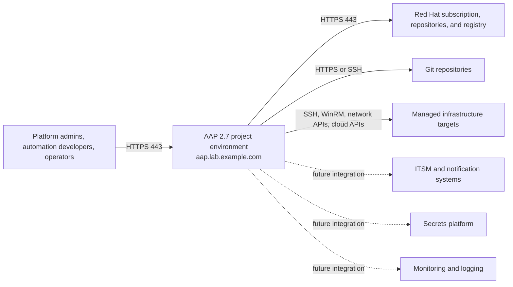
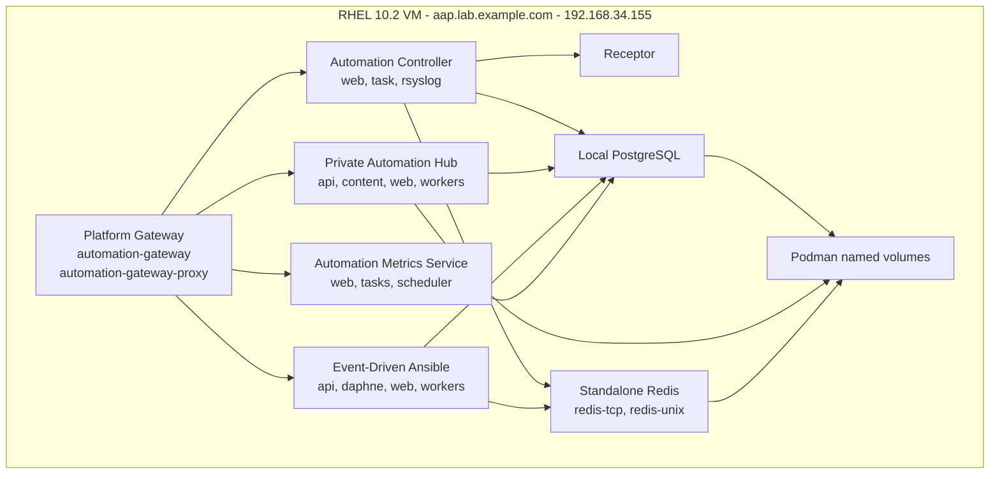
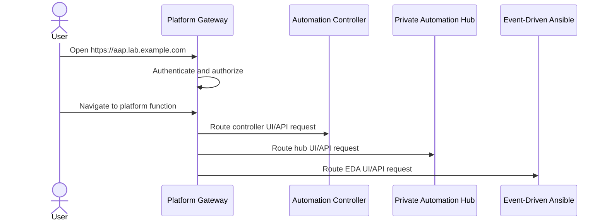
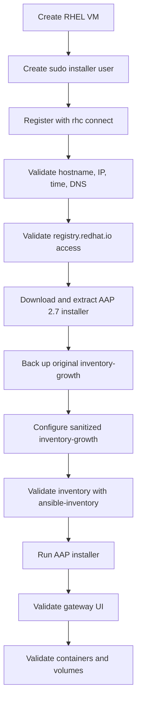

# Architecture Views

## Purpose

This document provides additional architecture views for the AAP 2.7 container growth topology project.

The main architecture diagram is available as:

- [images/aap-27-containerized-architecture.svg](images/aap-27-containerized-architecture.svg)
- [images/aap-27-containerized-architecture.png](images/aap-27-containerized-architecture.png)

The views below focus on context, deployment, and data flow.

## Context View

## Deployment View

## Access Flow

## Installation Flow

## Data And Persistence View

| Data Area | Location | Protection Consideration |
| --- | --- | --- |
| Platform configuration | PostgreSQL | Back up and protect as sensitive platform state. |
| Job history | PostgreSQL | Define retention and audit requirements before production. |
| Hub content | Hub data volume and PostgreSQL | Protect collection and execution environment content. |
| EDA state | EDA data and PostgreSQL | Include in backup and restore validation. |
| Redis data | Redis volumes | Keep internal to the platform network. |
| Installer inventory | Installer directory and Git-safe sanitized copy | Keep private values out of public repositories. |
| Subscription manifest | Platform UI and private file handling process | Do not commit manifest files. |
| Certificates and keys | Platform-managed paths | Protect and rotate through approved process. |

## Architecture Interpretation

This architecture is intentionally compact. It gives a complete view of AAP 2.7 services on one VM, but every major platform component shares the same compute, storage, network, and failure domain.

That makes the design useful for learning and validation, but production requirements should trigger a review of enterprise topology, external PostgreSQL, trusted certificates, SSO, RBAC, backup/restore testing, monitoring, automation mesh, and disaster recovery.

