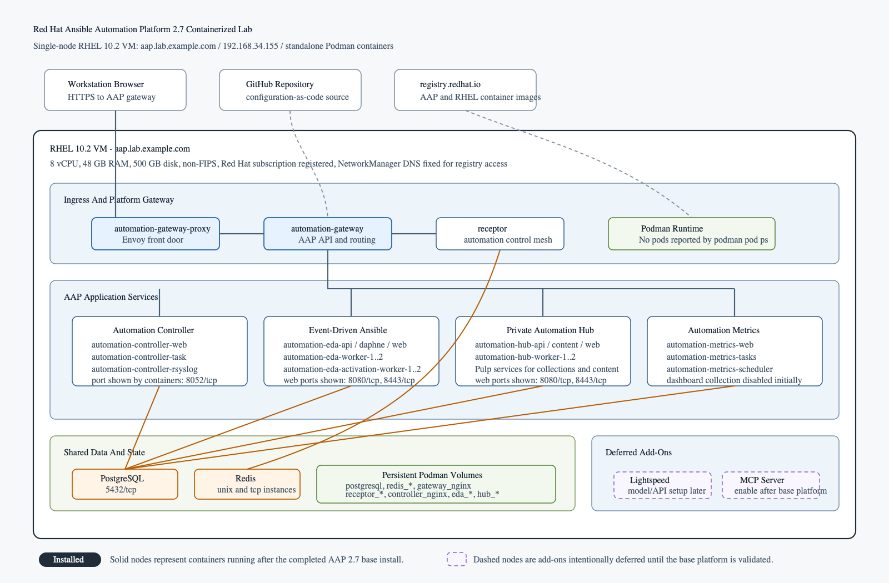
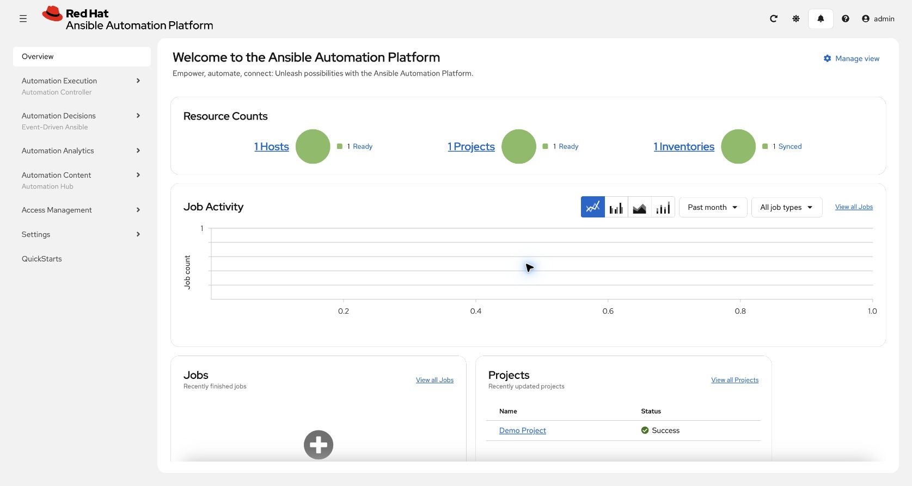

# Red Hat Ansible Automation Platform 2.7 All-in-One Installation

## Table of Contents

- [Introduction](#introduction)
- [Target Architecture](#target-architecture)
- [System Requirements](#system-requirements)
- [Understanding hub_seed_collections](#understanding-hub_seed_collections)
- [Lab Environment Used](#lab-environment-used)
- [Installation Steps](#installation-steps)
- [Post Installation Validation](#post-installation-validation)
- [Troubleshooting Notes](#troubleshooting-notes)
- [Summary](#summary)
- [References](#references)

## Introduction

This guide explains how to install Red Hat Ansible Automation Platform 2.7 as an all-in-one containerized deployment on a single Red Hat Enterprise Linux virtual machine.

The goal is to build a practical lab that includes the core AAP services on one host:

- platform gateway
- automation controller
- private automation hub
- Event-Driven Ansible controller
- Automation Metrics Service
- local PostgreSQL database
- Redis

This is not a high availability deployment. It is a lab-oriented container growth topology that is useful for learning, demos, configuration-as-code testing, and portfolio projects.

## Target Architecture



The deployment uses the AAP 2.7 containerized installer and the `inventory-growth` inventory file. The installer is executed locally on the same VM where AAP is installed, so the inventory uses:

```ini
ansible_connection=local
```

## System Requirements

Before starting, make sure you have:

- Red Hat account with access to Ansible Automation Platform 2.7 downloads.
- Active Red Hat subscription for the RHEL VM.
- Red Hat registry credentials or service account credentials for `registry.redhat.io`.
- Red Hat Enterprise Linux host supported by the AAP 2.7 containerized installer.
- Non-root installation user with sudo access.
- Static IP address.
- Fully qualified domain name.
- Working DNS resolution from the VM and from the workstation.
- Time synchronization enabled.
- Internet access from the VM to Red Hat services.

The official AAP 2.7 containerized installer system requirements include:

| Requirement | Minimum / Supported Value |
| --- | --- |
| Operating system | RHEL 9.6 or later minor versions of RHEL 9, or RHEL 10 or later minor versions of RHEL 10 |
| CPU architecture | `x86_64`, `AArch64`, `s390x`, or `ppc64le` |
| CPU | 4 vCPU minimum |
| Memory | 16 GB minimum |
| Disk | 60 GB total available disk space minimum |
| Disk IOPS | 3000 minimum |
| Installation directory | 15 GB if using a dedicated partition |
| `/var/tmp` for online install | 1 GB |
| `/var/tmp` for offline or bundled install | 3 GB |
| Temporary directory for offline or bundled install | 10 GB |

> [!NOTE]
> For growth topology bundled installations with `hub_seed_collections=true`, Red Hat documents 32 GB memory as required. In this lab, `hub_seed_collections=false` was used.

## Understanding hub_seed_collections

The `hub_seed_collections` variable controls whether the installer seeds private automation hub with initial automation content during installation.

Use:

```ini
hub_seed_collections=true
```

when you want the installer to seed automation hub content during the initial deployment. This can be useful when you want a more complete hub experience immediately after installation, but it increases installation time and resource usage. Red Hat documents a higher memory requirement for growth topology bundled installations when this value is enabled.

Use:

```ini
hub_seed_collections=false
```

when you want a smaller and faster base platform installation. With this option, private automation hub is installed, but you can add or sync collections later after the platform is stable.

This lab used:

```ini
hub_seed_collections=false
```

The reason was practical: first complete the all-in-one platform installation, verify gateway, controller, hub, EDA, metrics, PostgreSQL, and Redis, then manage automation content as a separate post-install milestone.

## Lab Environment Used

The installation in this guide was completed with the following lab configuration:

| Setting | Value |
| --- | --- |
| AAP version | 2.7 |
| Installer package | `ansible-automation-platform-containerized-setup-2.7-2` |
| Topology | Container growth / all-in-one |
| Hostname/FQDN | `aap.lab.example.com` |
| Static IP | `192.168.34.155` |
| Operating system | Red Hat Enterprise Linux 10.2 |
| Architecture | ARM64 / AArch64 |
| Virtualization | VMware |
| Network interface | `enp2s0` |
| FIPS mode | Disabled |
| Installer user | `rajat` |
| Installer user sudo access | Enabled through `wheel` |
| vCPU | 8 |
| RAM | 48 GB |
| Disk | 500 GB |
| Podman version | 5.8.2 |
| Time zone | `America/Toronto` |

### FIPS Decision

This lab was installed in non-FIPS mode.

If you need FIPS mode, enable FIPS during the RHEL installation. Do not install AAP first and attempt to retrofit FIPS later.

## Installation Steps

### Step 1 - Create The RHEL VM

Create a RHEL VM with at least the official minimum resources. For this lab, the VM was created with:

- 8 vCPU
- 48 GB RAM
- 500 GB disk
- RHEL 10.2
- static IPv4 address
- non-FIPS mode

Set the hostname:

```console
[rajat@aap ~]$ sudo hostnamectl set-hostname aap.lab.example.com
```

This command does not return output when it completes successfully.

Reboot if needed:

```console
[rajat@aap ~]$ sudo reboot
```

### Step 2 - Create A Sudo User

This lab used a non-root user named `rajat`.

Verify the user and group membership:

```console
[rajat@aap ~]$ id rajat
[rajat@aap ~]$ groups rajat
```

Output from this lab:

```text
uid=1000(rajat) gid=1000(rajat) groups=1000(rajat),10(wheel),190(systemd-journal)
rajat : rajat wheel systemd-journal
```

The user should be part of the `wheel` group:

```text
rajat : rajat wheel
```

If needed, add the user to `wheel`:

```console
[rajat@aap ~]$ sudo usermod -aG wheel rajat
```

This command does not return output when it completes successfully.

Log out and log back in after changing group membership.

### Step 3 - Register The RHEL System

Register the VM to Red Hat Subscription Management. In this lab, `rhc status` was used for validation:

```console
[rajat@aap ~]$ sudo rhc status
```

Output from this lab:

```text
Connection status for aap.lab.example.com:

 [OK] Connected to Red Hat Subscription Management
  [OK] Content ... Red Hat repository file generated
  [OK] Analytics ... Connected to Red Hat Lightspeed (formerly Insights)
  [OK] Remote Management ... The yggdrasil service is active

Manage your connected systems: https://red.ht/connector
```

Expected status:

- connected to Red Hat Subscription Management
- Red Hat repository file generated
- connected to Red Hat Lightspeed or Insights

Update the system:

```console
[rajat@aap ~]$ sudo dnf update -y
```

Output from this lab when the system was already current:

```text
Updating Subscription Management repositories.
Dependencies resolved.
Nothing to do.
Complete!
```

Verify Podman:

```console
[rajat@aap ~]$ podman --version
```

The lab showed:

```text
podman version 5.8.2
```

### Step 4 - Validate Hostname, IP, And Time

Run:

```console
[rajat@aap ~]$ hostnamectl
[rajat@aap ~]$ ip addr
[rajat@aap ~]$ timedatectl
```

Output from this lab:

```text
$ hostnamectl
 Static hostname: aap.lab.example.com
       Icon name: computer-vm
         Chassis: vm
      Machine ID: c7a92dd1a4b4492b96f160a008694a6b
         Boot ID: ce1ddcbc6e734631a2bf37d954fad598
    AF_VSOCK CID: 2260614082
  Virtualization: vmware
Operating System: Red Hat Enterprise Linux 10.2 (Coughlan)
     CPE OS Name: cpe:/o:redhat:enterprise_linux:10.2
          Kernel: Linux 6.12.0-211.34.1.el10_2.aarch64
    Architecture: arm64
 Hardware Vendor: VMware, Inc.
  Hardware Model: VMware20,1
Firmware Version: VMW201.00V.25275966.BA64.2603102050
   Firmware Date: Tue 2026-03-10
    Firmware Age: 4month 1w 2d

$ ip addr
1: lo: <LOOPBACK,UP,LOWER_UP> mtu 65536 qdisc noqueue state UNKNOWN group default qlen 1000
    link/loopback 00:00:00:00:00:00 brd 00:00:00:00:00:00
    inet 127.0.0.1/8 scope host lo
       valid_lft forever preferred_lft forever
    inet6 ::1/128 scope host noprefixroute
       valid_lft forever preferred_lft forever
2: enp2s0: <BROADCAST,MULTICAST,UP,LOWER_UP> mtu 1500 qdisc fq_codel state UP group default qlen 1000
    link/ether 00:0c:29:be:3b:c2 brd ff:ff:ff:ff:ff:ff
    altname enx000c29be3bc2
    inet 192.168.34.155/24 brd 192.168.34.255 scope global noprefixroute enp2s0
       valid_lft forever preferred_lft forever
    inet6 fe80::20c:29ff:febe:3bc2/64 scope link noprefixroute
       valid_lft forever preferred_lft forever

$ timedatectl
               Local time: Sat 2026-07-18 19:17:37 EDT
           Universal time: Sat 2026-07-18 23:17:37 UTC
                 RTC time: Sat 2026-07-18 23:17:38
                Time zone: America/Toronto (EDT, -0400)
System clock synchronized: yes
              NTP service: active
          RTC in local TZ: no
```

### Step 5 - Configure Name Resolution

The VM must resolve its own FQDN to the static IPv4 address.

Edit `/etc/hosts`:

```console
[rajat@aap ~]$ sudo vi /etc/hosts
```

Add:

```text
192.168.34.155 aap.lab.example.com aap
```

Output from this lab:

```text
$ cat /etc/hosts
# Loopback entries; do not change.
# For historical reasons, localhost precedes localhost.localdomain:
127.0.0.1   localhost localhost.localdomain localhost4 localhost4.localdomain4
::1         localhost localhost.localdomain localhost6 localhost6.localdomain6
# See hosts(5) for proper format and other examples:
# 192.168.1.10 foo.example.org foo
# 192.168.1.13 bar.example.org bar
192.168.34.155 aap.lab.example.com aap
```

Validate:

```console
[rajat@aap ~]$ getent hosts aap.lab.example.com
[rajat@aap ~]$ getent ahostsv4 aap.lab.example.com
```

In this lab, `getent hosts` returned an IPv6 link-local address through `myhostname`, but IPv4 lookup worked correctly:

```text
$ getent hosts aap.lab.example.com
fe80::20c:29ff:febe:3bc2 aap.lab.example.com

$ getent ahostsv4 aap.lab.example.com
192.168.34.155  STREAM aap.lab.example.com
192.168.34.155  DGRAM
192.168.34.155  RAW
```

Confirm host lookup order:

```console
[rajat@aap ~]$ grep '^hosts:' /etc/nsswitch.conf
```

Expected:

```text
$ grep '^hosts:' /etc/nsswitch.conf
hosts:      files  dns myhostname
```

### Step 6 - Validate Workstation Access

From your workstation, confirm that the VM is reachable:

```console
$ ping 192.168.34.155
$ ping aap.lab.example.com
$ ssh rajat@aap.lab.example.com
```

Output from this lab workstation:

```text
$ ping -c 2 192.168.34.155
PING 192.168.34.155 (192.168.34.155): 56 data bytes
64 bytes from 192.168.34.155: icmp_seq=0 ttl=64 time=0.431 ms
64 bytes from 192.168.34.155: icmp_seq=1 ttl=64 time=1.158 ms

--- 192.168.34.155 ping statistics ---
2 packets transmitted, 2 packets received, 0.0% packet loss
round-trip min/avg/max/stddev = 0.431/0.794/1.158/0.363 ms

$ ping -c 2 aap.lab.example.com
PING aap.lab.example.com (192.168.34.155): 56 data bytes
64 bytes from 192.168.34.155: icmp_seq=0 ttl=64 time=0.525 ms
64 bytes from 192.168.34.155: icmp_seq=1 ttl=64 time=0.848 ms

--- aap.lab.example.com ping statistics ---
2 packets transmitted, 2 packets received, 0.0% packet loss
round-trip min/avg/max/stddev = 0.525/0.686/0.848/0.161 ms
```

If your workstation cannot resolve `aap.lab.example.com`, add the same entry to your local DNS or workstation hosts file.

### Step 7 - Validate Registry DNS And Login

The online containerized installer pulls images from `registry.redhat.io`.

Run on the VM:

```console
[rajat@aap ~]$ getent hosts registry.redhat.io
[rajat@aap ~]$ curl -I https://registry.redhat.io/v2/
```

Output from this lab:

```text
$ getent hosts registry.redhat.io
2600:1f18:d77:9000:b0b1:dd53:cab5:bbc3 registry-proxy-134442355.us-east-1.elb.amazonaws.com registry.redhat.io
2600:1f18:d77:9001:21a:aeb5:d63e:eb0f registry-proxy-134442355.us-east-1.elb.amazonaws.com registry.redhat.io
2600:1f18:d77:9001:ca6:8904:2a40:eabf registry-proxy-134442355.us-east-1.elb.amazonaws.com registry.redhat.io
2600:1f18:d77:9002:560d:db51:6200:3bd6 registry-proxy-134442355.us-east-1.elb.amazonaws.com registry.redhat.io
2600:1f18:d77:9002:a26e:8165:eae1:8ae5 registry-proxy-134442355.us-east-1.elb.amazonaws.com registry.redhat.io
2600:1f18:d77:9000:fe19:bebe:cb94:9f0c registry-proxy-134442355.us-east-1.elb.amazonaws.com registry.redhat.io

$ curl -I -sS https://registry.redhat.io/v2/
HTTP/2 401
date: Sat, 18 Jul 2026 23:17:38 GMT
content-type: application/json
content-length: 99
docker-distribution-api-version: registry/2.0
www-authenticate: Bearer realm="https://registry.redhat.io/auth/realms/rhcc/protocol/redhat-docker-v2/auth",service="docker-registry"
```

An HTTP `401 Unauthorized` response from `curl` is acceptable before login. It confirms DNS, routing, and TLS connectivity.

Log in to the registry:

```console
[rajat@aap ~]$ podman login registry.redhat.io
```

Expected result:

```text
Login Succeeded!
```

### Step 9 - Download And Extract The AAP Installer

Download the AAP 2.7 containerized setup package from the Red Hat Customer Portal.

In this lab, the package was placed under `/home/rajat`:

```text
/home/rajat/ansible-automation-platform-containerized-setup-2.7-2.tar
/home/rajat/ansible-automation-platform-containerized-setup-2.7-2/
```

If you have the tar file, extract it:

```console
[rajat@aap ~]$ cd /home/rajat
[rajat@aap ~]$ tar -xf ansible-automation-platform-containerized-setup-2.7-2.tar
[rajat@aap ~]$ cd ansible-automation-platform-containerized-setup-2.7-2
```

The `cd` and `tar -xf` commands do not return output when they complete successfully. Verify extraction by inspecting the installer directory.

Inspect the installer directory:

```console
[rajat@aap ansible-automation-platform-containerized-setup-2.7-2]$ ls -la
[rajat@aap ansible-automation-platform-containerized-setup-2.7-2]$ ls -la inventory*
```

Output from this lab:

```text
$ ls -la /home/rajat/ansible-automation-platform-containerized-setup-2.7-2
total 472
drwxr-xr-x.  3 rajat rajat    158 Jul 14 23:48 .
drwx------. 18 rajat rajat   4096 Jul 14 23:49 ..
-rw-r--r--.  1 rajat rajat 384772 Jul 15 00:00 aap_install.log
-rw-r--r--.  1 rajat rajat    146 Jun 18 11:52 ansible.cfg
drwxr-xr-x.  3 rajat rajat     33 Jun 18 11:52 collections
-rw-r--r--.  1 rajat rajat   3662 Jun 18 11:52 inventory
-rw-r--r--.  1 rajat rajat   3429 Jul 14 23:48 inventory-growth
-rw-r--r--.  1 rajat rajat   3443 Jun 18 11:52 inventory-growth.original
-rw-r--r--.  1 rajat rajat  74768 Jun 18 11:52 README.md

$ ls -la inventory*
-rw-r--r--. 1 rajat rajat 3662 Jun 18 11:52 inventory
-rw-r--r--. 1 rajat rajat 3429 Jul 14 23:48 inventory-growth
-rw-r--r--. 1 rajat rajat 3443 Jun 18 11:52 inventory-growth.original
```

### Step 10 - Back Up The Original Inventory

The installer includes inventory examples. This lab used `inventory-growth`.

Back up the original file:

```console
[rajat@aap ansible-automation-platform-containerized-setup-2.7-2]$ cp -p inventory-growth inventory-growth.original
[rajat@aap ansible-automation-platform-containerized-setup-2.7-2]$ chmod 400 inventory-growth.original
[rajat@aap ansible-automation-platform-containerized-setup-2.7-2]$ chmod 600 inventory-growth
```

These commands do not return output when they complete successfully.

This gives you a clean reference copy if the install fails.

### Step 11 - Configure `inventory-growth`

Edit `inventory-growth` directly:

```console
[rajat@aap ansible-automation-platform-containerized-setup-2.7-2]$ vi inventory-growth
```

The sanitized inventory used for this lab is shown below. The real VM-side inventory used private values, but all password values are hidden here with `<hiddeen>`.

> [!IMPORTANT]
> Do not paste `<hiddeen>` into a real installer inventory. Replace every `<hiddeen>` value with a private password before running the installer. Replace `<username>` with your Red Hat registry username or service account username.

```ini
# This is the AAP installer inventory file intended for the Container growth deployment topology.
# This inventory file expects to be run from the host where AAP will be installed.
# Please consult the Ansible Automation Platform product documentation about this topology's tested hardware configuration.
# https://docs.redhat.com/en/documentation/red_hat_ansible_automation_platform/2.7/plan-ref_installation_deployment_models
#
# Please consult the docs if you're unsure what to add.
# For all optional variables, consult the included README.md
# or the Ansible Automation Platform documentation:
# https://docs.redhat.com/en/documentation/red_hat_ansible_automation_platform/2.7/install-con_aap_containerized_installation_intro

# This section is for your AAP Gateway host(s)
# -----------------------------------------------------
[automationgateway]
aap.lab.example.com

# This section is for your AAP Controller host(s)
# -----------------------------------------------------
[automationcontroller]
aap.lab.example.com

# This section is for your AAP Automation Hub host(s)
# -----------------------------------------------------
[automationhub]
aap.lab.example.com

# This section is for your AAP EDA Controller host(s)
# -----------------------------------------------------
[automationeda]
aap.lab.example.com

# This section is for your AAP Automation Metrics Service host(s)
# -----------------------------------------------------
[automationmetrics]
aap.lab.example.com

# This section is for your AAP Lightspeed host(s)
# -----------------------------------------------------
# [ansiblelightspeed]
# aap.example.org

# This section is for your Ansible MCP Server host(s)
# -----------------------------------------------------
# [ansiblemcp]
# aap.example.org

# This section is for the AAP database
# -----------------------------------------------------
[database]
aap.lab.example.com

[all:vars]
# Ansible
ansible_connection=local

# For a comprehensive list of all inventory file variables, see:
# https://docs.redhat.com/en/documentation/red_hat_ansible_automation_platform/2.7/install-assembly_appendix_inventory_file_vars

# Common variables
# -----------------------------------------------------
postgresql_admin_username=postgres
postgresql_admin_password=<hiddeen>

registry_username=<username>
registry_password=<hiddeen>

redis_mode=standalone

# AAP Gateway
# -----------------------------------------------------
gateway_admin_password=<hiddeen>
gateway_pg_host=aap.lab.example.com
gateway_pg_password=<hiddeen>

# AAP Controller
# -----------------------------------------------------
controller_admin_password=<hiddeen>
controller_pg_host=aap.lab.example.com
controller_pg_password=<hiddeen>
controller_percent_memory_capacity=0.5

# AAP Automation Hub
# -----------------------------------------------------
hub_admin_password=<hiddeen>
hub_pg_host=aap.lab.example.com
hub_pg_password=<hiddeen>
hub_seed_collections=false

# AAP EDA Controller
# -----------------------------------------------------
eda_admin_password=<hiddeen>
eda_pg_host=aap.lab.example.com
eda_pg_password=<hiddeen>

# AAP Automation Metrics Service
# -----------------------------------------------------
automationmetrics_pg_host=aap.lab.example.com
automationmetrics_pg_password=<hiddeen>
automationmetrics_controller_read_pg_host=aap.lab.example.com
automationmetrics_controller_read_pg_password=<hiddeen>
FEATURE_DASHBOARD_COLLECTION_ENABLED=false
```

### Inventory Group Explanation

| Section | Value used | Explanation |
| --- | --- | --- |
| `[automationgateway]` | `aap.lab.example.com` | Installs the platform gateway on the all-in-one VM. The gateway is the main web and API entry point for AAP 2.7. |
| `[automationcontroller]` | `aap.lab.example.com` | Installs automation controller on the same VM. Controller manages inventories, credentials, projects, job templates, workflows, and job execution. |
| `[automationhub]` | `aap.lab.example.com` | Installs private automation hub on the same VM. Hub manages automation content such as collections and execution environment content. |
| `[automationeda]` | `aap.lab.example.com` | Installs Event-Driven Ansible controller on the same VM. EDA handles rulebooks, event sources, and event-driven automation. |
| `[automationmetrics]` | `aap.lab.example.com` | Installs Automation Metrics Service on the same VM. For this AAP 2.7 growth topology, the installer preflight required a metrics node. |
| `[database]` | `aap.lab.example.com` | Places PostgreSQL on the same VM. Each platform service uses PostgreSQL, but this lab keeps the database local. |
| `# [ansiblelightspeed]` | commented | Lightspeed was intentionally deferred. It can be added later after the base platform is stable and the required model/provider configuration is ready. |
| `# [ansiblemcp]` | commented | Ansible MCP Server was intentionally deferred. It can be added later as a separate milestone after the base platform install is validated. |
| `[all:vars]` | applies globally | Defines variables that apply to all hosts in the inventory. In this lab, there is only one host. |

### Inventory Variable Explanation

| Variable | Value used | Explanation |
| --- | --- | --- |
| `ansible_connection` | `local` | Tells Ansible to run installer tasks locally on the same VM instead of using SSH to reach another host. This is correct because the installer runs from `aap.lab.example.com` and installs AAP on `aap.lab.example.com`. |
| `postgresql_admin_username` | `postgres` | PostgreSQL administrative user used by the installer when creating platform databases and database users. The installer default is `postgres`, and this lab kept that value. |
| `postgresql_admin_password` | `<hiddeen>` | Password for the PostgreSQL admin user. It is required for database creation and must be a real private value in the VM inventory. |
| `registry_username` | `<username>` | Red Hat registry username or service account username used to pull AAP container images from `registry.redhat.io`. |
| `registry_password` | `<hiddeen>` | Red Hat registry password or service account token. This must never be committed to Git. |
| `redis_mode` | `standalone` | Configures Redis in standalone mode. This is appropriate for a single-node lab. The installer also supports `cluster`, which is more relevant to multi-node or enterprise topologies. |
| `gateway_admin_password` | `<hiddeen>` | Password for the AAP platform gateway admin user. This is the password used when logging into the platform UI as `admin` unless you also customize the admin username. |
| `gateway_pg_host` | `aap.lab.example.com` | PostgreSQL host used by platform gateway. Because this is all-in-one, gateway connects to PostgreSQL on the same VM. |
| `gateway_pg_password` | `<hiddeen>` | Database password for the platform gateway database user. |
| `controller_admin_password` | `<hiddeen>` | Admin password for automation controller. In AAP 2.7, users normally enter through the platform gateway, but controller still needs its own service/admin configuration during installation. |
| `controller_pg_host` | `aap.lab.example.com` | PostgreSQL host used by automation controller. This points to the local VM in the all-in-one build. |
| `controller_pg_password` | `<hiddeen>` | Database password for the automation controller database user. |
| `controller_percent_memory_capacity` | `0.5` | Limits automation controller memory capacity calculation to 50 percent of detected system memory. The installer accepts values from `0.01` to `1.0`; this lab used `0.5` to leave memory for gateway, hub, EDA, metrics, PostgreSQL, Redis, and the operating system on the same VM. |
| `hub_admin_password` | `<hiddeen>` | Admin password for private automation hub. |
| `hub_pg_host` | `aap.lab.example.com` | PostgreSQL host used by automation hub. This points to the local VM in the all-in-one build. |
| `hub_pg_password` | `<hiddeen>` | Database password for the automation hub database user. |
| `hub_seed_collections` | `false` | Prevents the installer from seeding private automation hub with initial collections during the base install. This keeps the first install faster and smaller. Collections can be synced or uploaded later. |
| `eda_admin_password` | `<hiddeen>` | Admin password for Event-Driven Ansible controller. |
| `eda_pg_host` | `aap.lab.example.com` | PostgreSQL host used by Event-Driven Ansible controller. This points to the local VM in the all-in-one build. |
| `eda_pg_password` | `<hiddeen>` | Database password for the Event-Driven Ansible controller database user. |
| `automationmetrics_pg_host` | `aap.lab.example.com` | PostgreSQL host used by Automation Metrics Service for its own database. |
| `automationmetrics_pg_password` | `<hiddeen>` | Database password for the Automation Metrics Service database user. |
| `automationmetrics_controller_read_pg_host` | `aap.lab.example.com` | PostgreSQL host for read-only access to the automation controller database. Metrics service needs this when automation controller is deployed so it can read controller data for reporting. |
| `automationmetrics_controller_read_pg_password` | `<hiddeen>` | Password for the metrics service read-only database access to automation controller data. |
| `FEATURE_DASHBOARD_COLLECTION_ENABLED` | `false` | Disables the automation dashboard collection feature flag during the initial install. This keeps the first all-in-one deployment focused on base platform health; dashboard collection can be enabled later if needed. |

### Step 12 - Validate The Inventory

Run:

```console
[rajat@aap ansible-automation-platform-containerized-setup-2.7-2]$ ansible-inventory -i inventory-growth --list
[rajat@aap ansible-automation-platform-containerized-setup-2.7-2]$ ansible-inventory -i inventory-growth --graph
```

Sanitized output from `ansible-inventory -i inventory-growth --list`:

```json
{
    "_meta": {
        "hostvars": {
            "aap.lab.example.com": {
                "FEATURE_DASHBOARD_COLLECTION_ENABLED": "false",
                "ansible_connection": "local",
                "automationmetrics_controller_read_pg_host": "aap.lab.example.com",
                "automationmetrics_controller_read_pg_password": "<hiddeen>",
                "automationmetrics_pg_host": "aap.lab.example.com",
                "automationmetrics_pg_password": "<hiddeen>",
                "controller_admin_password": "<hiddeen>",
                "controller_percent_memory_capacity": 0.5,
                "controller_pg_host": "aap.lab.example.com",
                "controller_pg_password": "<hiddeen>",
                "eda_admin_password": "<hiddeen>",
                "eda_pg_host": "aap.lab.example.com",
                "eda_pg_password": "<hiddeen>",
                "gateway_admin_password": "<hiddeen>",
                "gateway_pg_host": "aap.lab.example.com",
                "gateway_pg_password": "<hiddeen>",
                "hub_admin_password": "<hiddeen>",
                "hub_pg_host": "aap.lab.example.com",
                "hub_pg_password": "<hiddeen>",
                "hub_seed_collections": "false",
                "postgresql_admin_password": "<hiddeen>",
                "postgresql_admin_username": "postgres",
                "redis_mode": "standalone",
                "registry_password": "<hiddeen>",
                "registry_username": "<username>"
            }
        }
    },
    "all": {
        "children": [
            "ungrouped",
            "automationgateway",
            "automationcontroller",
            "automationhub",
            "automationeda",
            "automationmetrics",
            "database"
        ]
    },
    "automationcontroller": {
        "hosts": [
            "aap.lab.example.com"
        ]
    },
    "automationeda": {
        "hosts": [
            "aap.lab.example.com"
        ]
    },
    "automationgateway": {
        "hosts": [
            "aap.lab.example.com"
        ]
    },
    "automationhub": {
        "hosts": [
            "aap.lab.example.com"
        ]
    },
    "automationmetrics": {
        "hosts": [
            "aap.lab.example.com"
        ]
    },
    "database": {
        "hosts": [
            "aap.lab.example.com"
        ]
    }
}
```

Output from `ansible-inventory -i inventory-growth --graph`:

```text
@all:
  |--@ungrouped:
  |--@automationgateway:
  |  |--aap.lab.example.com
  |--@automationcontroller:
  |  |--aap.lab.example.com
  |--@automationhub:
  |  |--aap.lab.example.com
  |--@automationeda:
  |  |--aap.lab.example.com
  |--@automationmetrics:
  |  |--aap.lab.example.com
  |--@database:
  |  |--aap.lab.example.com
```

Check for unresolved placeholders, example domains, and hostname typos:

```console
[rajat@aap ansible-automation-platform-containerized-setup-2.7-2]$ awk '!/^[[:space:]]*#/ && /CHANGE_ME|<[^>]+>|example[.]org|examaple|examle/ { print FNR ":" $0 }' inventory-growth
```

This command should return no output in your real VM inventory. If it returns active lines, fix them before running the installer.

Output from this lab:

```text
# no output
```

### Step 13 - Run The Installer

From the extracted installer directory:

```console
[rajat@aap ansible-automation-platform-containerized-setup-2.7-2]$ ansible-playbook -i inventory-growth -K ansible.containerized_installer.install
```

Use `-K` because the `rajat` user uses sudo privilege escalation.

If you need more detail during troubleshooting:

```console
[rajat@aap ansible-automation-platform-containerized-setup-2.7-2]$ ansible-playbook -i inventory-growth -K -v ansible.containerized_installer.install
```

Wait for the playbook to complete successfully.

## Post Installation Validation

### Validate AAP From The Browser

Open:

```text
https://aap.lab.example.com
```

Log in with:

- username: `admin`
- password: value configured in `gateway_admin_password`

After login, the AAP overview dashboard should load.



### Validate Containers

Run:

```console
[rajat@aap ansible-automation-platform-containerized-setup-2.7-2]$ podman ps
[rajat@aap ansible-automation-platform-containerized-setup-2.7-2]$ podman pod ps
[rajat@aap ansible-automation-platform-containerized-setup-2.7-2]$ podman volume ls
```

Optional formatted view:

```console
[rajat@aap ansible-automation-platform-containerized-setup-2.7-2]$ podman ps --format 'table {{.Names}}\t{{.Status}}\t{{.Ports}}'
```

Output from this lab:

```text
$ podman ps --format 'table {{.Names}}\t{{.Status}}\t{{.Ports}}'
NAMES                               STATUS      PORTS
postgresql                          Up 3 days   5432/tcp
redis-unix                          Up 3 days   6379/tcp
redis-tcp                           Up 3 days   6379/tcp
automation-gateway-proxy            Up 3 days
automation-gateway                  Up 3 days
receptor                            Up 3 days
automation-controller-rsyslog       Up 3 days   8052/tcp
automation-controller-task          Up 3 days   8052/tcp
automation-controller-web           Up 3 days   8052/tcp
automation-eda-api                  Up 3 days
automation-eda-daphne               Up 3 days
automation-eda-web                  Up 3 days   8080/tcp, 8443/tcp
automation-eda-worker-1             Up 3 days
automation-eda-worker-2             Up 3 days
automation-eda-activation-worker-1  Up 3 days
automation-eda-activation-worker-2  Up 3 days
automation-hub-api                  Up 3 days
automation-hub-content              Up 3 days
automation-hub-web                  Up 3 days   8080/tcp, 8443/tcp
automation-hub-worker-1             Up 3 days
automation-hub-worker-2             Up 3 days
automation-metrics-web              Up 3 days
automation-metrics-tasks            Up 3 days
automation-metrics-scheduler        Up 3 days

$ podman pod ps
POD ID      NAME        STATUS      CREATED     INFRA ID    # OF CONTAINERS

$ podman volume ls
DRIVER      VOLUME NAME
local       postgresql
local       redis_data_unix
local       redis_run
local       redis_data_tcp
local       gateway_nginx
local       receptor_run
local       receptor_runner
local       receptor_home
local       receptor_data
local       controller_nginx
local       eda_data
local       eda_nginx
local       hub_data
local       hub_nginx
```

The successful lab showed containers for:

- `postgresql`
- `redis-unix`
- `redis-tcp`
- `automation-gateway-proxy`
- `automation-gateway`
- `receptor`
- `automation-controller-rsyslog`
- `automation-controller-task`
- `automation-controller-web`
- `automation-eda-api`
- `automation-eda-daphne`
- `automation-eda-web`
- `automation-eda-worker-1`
- `automation-eda-worker-2`
- `automation-eda-activation-worker-1`
- `automation-eda-activation-worker-2`
- `automation-hub-api`
- `automation-hub-content`
- `automation-hub-web`
- `automation-hub-worker-1`
- `automation-hub-worker-2`
- `automation-metrics-web`
- `automation-metrics-tasks`
- `automation-metrics-scheduler`

The successful lab also created local Podman volumes for PostgreSQL, Redis, gateway, receptor, controller, EDA, and hub data.

## Troubleshooting Notes

### Automation Metrics Preflight Failure

If the installer fails with:

```text
You must have a host set in the [automationmetrics] section
```

Enable this group:

```ini
[automationmetrics]
aap.lab.example.com
```

Also define the metrics database variables:

```ini
automationmetrics_pg_host=aap.lab.example.com
automationmetrics_pg_password=<hiddeen>
automationmetrics_controller_read_pg_host=aap.lab.example.com
automationmetrics_controller_read_pg_password=<hiddeen>
FEATURE_DASHBOARD_COLLECTION_ENABLED=false
```

### Registry DNS Failure

If `podman login registry.redhat.io` fails with a DNS lookup error, fix DNS first. This is not usually a registry password problem.

Validate:

```console
[rajat@aap ~]$ getent hosts registry.redhat.io
[rajat@aap ~]$ curl -I https://registry.redhat.io/v2/
```

Then adjust NetworkManager DNS if required:

```console
[rajat@aap ~]$ CON=$(nmcli -t -f NAME,DEVICE connection show --active | awk -F: '$2=="enp2s0"{print $1; exit}')
[rajat@aap ~]$ sudo nmcli connection modify "$CON" ipv4.ignore-auto-dns yes
[rajat@aap ~]$ sudo nmcli connection modify "$CON" ipv4.dns "1.1.1.1 8.8.8.8"
[rajat@aap ~]$ sudo nmcli connection up "$CON"
```

### Hostname Typo

A small hostname typo can break database connectivity or component registration.

Check for common mistakes:

```console
[rajat@aap ansible-automation-platform-containerized-setup-2.7-2]$ awk '!/^[[:space:]]*#/ && /examaple|examle/ { print FNR ":" $0 }' inventory-growth
```

The correct lab FQDN is:

```text
aap.lab.example.com
```

### Certificate Warning In Browser

For a lab with installer-generated certificates, the browser might show a certificate warning.

For production, use certificates trusted by your organization. For a lab, you can either proceed through the browser warning or import the generated certificate into your workstation trust store after verifying its fingerprint.

## Summary

By following this guide, you installed Red Hat Ansible Automation Platform 2.7 as an all-in-one containerized lab on Red Hat Enterprise Linux 10.2.

You completed:

- VM preparation
- hostname and DNS validation
- Red Hat subscription validation using `rhc status`
- Podman and registry access validation
- AAP 2.7 installer extraction
- `inventory-growth` backup and configuration
- all-in-one AAP 2.7 installation
- browser and container-level validation

The platform is now ready for the next phase: configuring AAP as code with organizations, teams, RBAC, inventories, projects, job templates, execution environments, workflows, notifications, and enterprise integrations.

## References

- [Red Hat Ansible Automation Platform 2.7 documentation](https://docs.redhat.com/en/documentation/red_hat_ansible_automation_platform/)
- [Red Hat AAP 2.7 system requirements](https://docs.redhat.com/en/documentation/red_hat_ansible_automation_platform/2.7/install-ref_cont_aap_system_requirements)
- [Install containerized Ansible Automation Platform](https://docs.redhat.com/en/documentation/red_hat_ansible_automation_platform/2.7/install-proc_installing_containerized_aap)
- [Install metrics service with containerized installer](https://docs.redhat.com/en/documentation/red_hat_ansible_automation_platform/2.7/install-task_install_metrics_service_with_containerized_installer)
