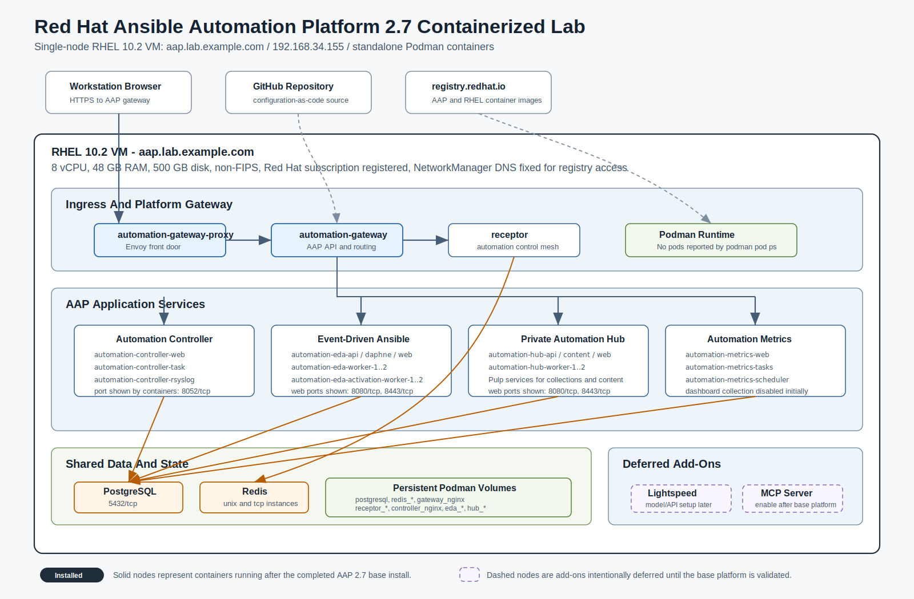

# Architecture

This project manages Red Hat Ansible Automation Platform as an enterprise automation service.

## AAP 2.7 Containerized Lab Diagram

Interactive explorer: [aap-architecture.html](interactive/aap-architecture.html). Open it locally or serve it through GitHub Pages for full interactivity.

PNG export: [aap-27-containerized-architecture.png](assets/aap-27-containerized-architecture.png)

## Logical Components

- GitHub repository: source of truth for platform configuration and automation content.
- Platform gateway: primary entry point for AAP APIs and services.
- Automation controller: runs inventories, credentials, projects, job templates, and workflows.
- Private Automation Hub: governs internal collections and execution environments.
- Execution environments: reproducible automation runtimes for Linux, cloud, network, and security workflows.
- Enterprise integrations: notifications, ticketing, secrets, and source control.

## Design Principles

- Platform configuration is declarative and stored in Git.
- Secrets are never stored in plaintext in the repository.
- Execution environments define runtime dependencies instead of relying on a developer laptop.
- RBAC separates platform administrators, automation developers, operators, auditors, and security teams.
- Every workflow should have validation, notification, and failure-handling behavior.

## Initial Lab Topology

The MVP assumes an existing AAP lab instance. The project connects to that instance and configures platform objects as code.

Future phases can add:

- single-node AAP lab setup documentation
- multi-node enterprise topology
- OpenShift-based AAP deployment notes
- Event-Driven Ansible remediation workflows
